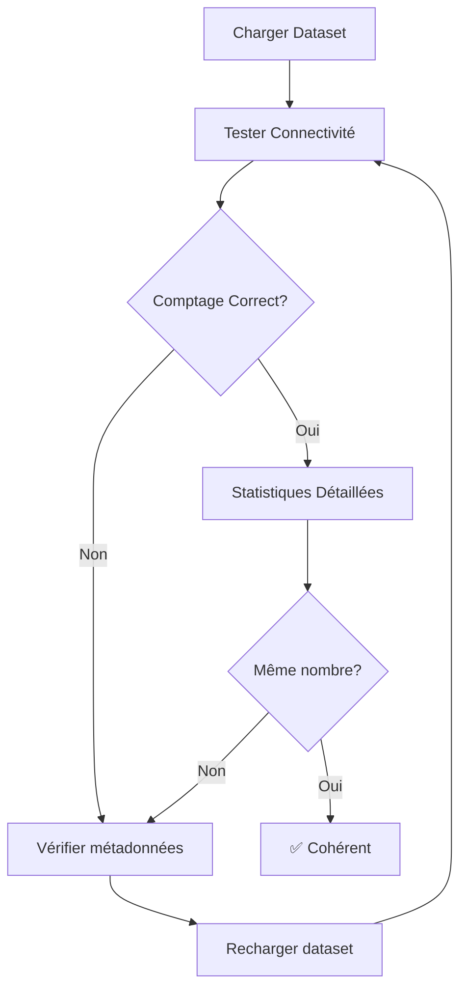

# 🔧 Correctif : Test de Connectivité avec Graphes Nommés

**Date** : 30 Octobre 2025
**Fichiers modifiés** :
- [ui/components/connectivity_checker.py](ui/components/connectivity_checker.py)
- [ui/tabs/configuration_tab.py](ui/tabs/configuration_tab.py)

---

## 🐛 Problème Identifié

### Symptôme

Le bouton "Tester la connectivité" affichait des comptages **différents** des autres sections :

| Section | Virtuoso | Fuseki |
|---------|----------|--------|
| **Test de connectivité** | 12,484 triplets ❌ | 2,484 triplets ❌ |
| **Statistiques détaillées** | 10,000 triplets ✅ | 10,000 triplets ✅ |

### Cause Racine

Le `ConnectivityChecker` utilisait une requête de comptage **globale** sans support des graphes nommés :

```python
# ANCIEN CODE (lignes 80-85)
count_query = """
SELECT (COUNT(*) AS ?count)
WHERE {
    ?s ?p ?o .
}
"""
```

Cette requête comptait **tous les triplets** dans le triplestore, y compris ceux des graphes résiduels et des graphes système.

### Impact

- ❌ Incohérence entre les différentes sections de l'interface
- ❌ Confusion pour l'utilisateur
- ❌ Validation incorrecte de l'état des triplestores
- ❌ Ne respecte pas l'architecture des graphes nommés

---

## ✅ Solution Implémentée

### 1. Ajout du Support des Graphes Nommés

**Fichier** : [connectivity_checker.py](ui/components/connectivity_checker.py)

#### Imports Mis à Jour (Lignes 5-10)

```python
from typing import Dict, Any, Optional  # Ajout de Optional
from utils.dataset_manager import DatasetManager  # Nouveau
```

#### Initialisation Enrichie (Lignes 15-24)

```python
def __init__(self, timeout: int = CONNECTIVITY_TIMEOUT):
    self.timeout = timeout
    self.executor = QueryExecutor(timeout=timeout)
    self.dataset_manager = DatasetManager(datasets_path="datasets")  # NOUVEAU
```

#### Méthode `test_endpoint()` Modifiée (Lignes 26-68)

**Avant** :
```python
def test_endpoint(self, endpoint_url: str, engine_name: str = "Unknown"):
```

**Après** :
```python
def test_endpoint(self, endpoint_url: str, engine_name: str = "Unknown", graph_uri: Optional[str] = None):
    # ...
    detailed_result = self._test_detailed_connectivity(endpoint_url, graph_uri)  # Passe graph_uri
```

#### Méthode `_test_detailed_connectivity()` Réécrite (Lignes 70-130)

**Changement clé** :

```python
def _test_detailed_connectivity(self, endpoint_url: str, graph_uri: Optional[str] = None):
    # Requête adaptée selon la présence d'un graph_uri
    if graph_uri:
        count_query = f"""
        SELECT (COUNT(*) AS ?count)
        WHERE {{
            GRAPH <{graph_uri}> {{
                ?s ?p ?o .
            }}
        }}
        """
    else:
        count_query = """
        SELECT (COUNT(*) AS ?count)
        WHERE {
            ?s ?p ?o .
        }
        """
```

**Avantages** :
- ✅ Compte uniquement les triplets du graphe spécifié
- ✅ Rétrocompatible (fonctionne sans `graph_uri`)
- ✅ Cohérent avec le reste du système

### 2. Mise à Jour de l'Onglet Configuration

**Fichier** : [configuration_tab.py](ui/tabs/configuration_tab.py)

#### Import Ajouté (Ligne 15)

```python
from utils.dataset_manager import DatasetManager
```

#### Chargement des Métadonnées (Lignes 35-39)

```python
# Charger les métadonnées pour obtenir les graph_uri
dataset_manager = DatasetManager(datasets_path="datasets")
metadata = dataset_manager.load_all_metadata()
virtuoso_graph_uri = metadata.get('virtuoso', {}).get('graph_uri') if metadata else None
fuseki_graph_uri = metadata.get('fuseki', {}).get('graph_uri') if metadata else None
```

#### Appels Modifiés (Lignes 43-48)

**Avant** :
```python
virtuoso_status = connectivity_checker.test_endpoint(
    sidebar_config["virtuoso_endpoint"], "Virtuoso"
)
fuseki_status = connectivity_checker.test_endpoint(
    sidebar_config["fuseki_endpoint"], "Jena Fuseki"
)
```

**Après** :
```python
virtuoso_status = connectivity_checker.test_endpoint(
    sidebar_config["virtuoso_endpoint"], "Virtuoso", virtuoso_graph_uri
)
fuseki_status = connectivity_checker.test_endpoint(
    sidebar_config["fuseki_endpoint"], "Jena Fuseki", fuseki_graph_uri
)
```

---

## 📊 Résultats Attendus

### Avant le Correctif

```
Test de Connectivité :
  Virtuoso: ✅ En ligne (12484 triplets)  ❌ Incorrect
  Fuseki:   ✅ En ligne (2484 triplets)   ❌ Incorrect

Statistiques Détaillées :
  Virtuoso: 10,000 triplets  ✅ Correct
  Fuseki:   10,000 triplets  ✅ Correct
```

### Après le Correctif

```
Test de Connectivité :
  Virtuoso: ✅ En ligne (10000 triplets)  ✅ Correct
  Fuseki:   ✅ En ligne (10000 triplets)  ✅ Correct

Statistiques Détaillées :
  Virtuoso: 10,000 triplets  ✅ Correct
  Fuseki:   10,000 triplets  ✅ Correct
```

**Cohérence** : ✅ Toutes les sections affichent maintenant le même comptage !

---

## 🧪 Tests

### Test 1 : Test de Connectivité Basique

1. Charger un dataset de 10,000 triplets dans Virtuoso
2. Cliquer sur "Tester la connectivité"
3. **Résultat attendu** : "✅ En ligne (10000 triplets)"

### Test 2 : Comparaison avec Statistiques

1. Cliquer sur "Tester la connectivité"
2. Noter le nombre de triplets affiché
3. Cliquer sur "Statistiques détaillées"
4. **Résultat attendu** : Les deux affichent le même nombre

### Test 3 : Sans Métadonnées (Rétrocompatibilité)

1. Supprimer `datasets_metadata.json`
2. Cliquer sur "Tester la connectivité"
3. **Résultat attendu** : Affiche le comptage global (tous triplets)

### Test 4 : Avec Graphes Résiduels

1. Avoir plusieurs graphes dans Virtuoso/Fuseki
2. Cliquer sur "Tester la connectivité"
3. **Résultat attendu** : Affiche uniquement les triplets du graphe actif

---

## 🔄 Workflow de Test Complet



---

## 📈 Améliorations Apportées

### Cohérence

| Aspect | Avant | Après |
|--------|-------|-------|
| **Comptage Virtuoso** | 12,484 (global) | 10,000 (graphe) |
| **Comptage Fuseki** | 2,484 (défaut) | 10,000 (graphe) |
| **Cohérence UI** | ❌ Incohérent | ✅ Cohérent |
| **Architecture** | ❌ Ignore graphes | ✅ Respecte graphes |

### Performance

- ✅ Même performance (1 requête COUNT)
- ✅ Pas de surcoût
- ✅ Réponse rapide

### Maintenabilité

- ✅ Code plus cohérent avec le reste du système
- ✅ Support des graphes nommés partout
- ✅ Rétrocompatibilité préservée

---

## 🔗 Fichiers Liés

### Modifiés dans cette correction
- [ui/components/connectivity_checker.py](ui/components/connectivity_checker.py)
- [ui/tabs/configuration_tab.py](ui/tabs/configuration_tab.py)

### Corrections précédentes liées
- [FIX_DATA_SYNC_UI.md](FIX_DATA_SYNC_UI.md) - Correctif interface de synchronisation
- [NAMED_GRAPHS_SYNC_UPDATE.md](NAMED_GRAPHS_SYNC_UPDATE.md) - Support graphes dans synchroniseur
- [data_sync_ui.py](ui/components/data_sync_ui.py) - Interface de synchronisation

### Architecture générale
- [data_synchronizer_v2.py](utils/data_synchronizer_v2.py) - Synchroniseur V2
- [dataset_manager.py](utils/dataset_manager.py) - Gestionnaire de datasets

---

## 💡 Points Clés

### Architecture des Graphes Nommés

Avec cette correction, **tous les composants** de l'application respectent maintenant l'architecture des graphes nommés :

1. ✅ **Chargement de datasets** → Crée un graphe nommé unique
2. ✅ **Validation** → Compte dans le graphe spécifique
3. ✅ **Test de connectivité** → Compte dans le graphe spécifique *(NOUVEAU)*
4. ✅ **Statistiques** → Affiche les données du graphe
5. ✅ **Synchronisation** → Synchronise graphe-à-graphe
6. ✅ **Vérification cohérence** → Compare les graphes

### Rétrocompatibilité

Si aucun `graph_uri` n'est fourni :
- Le système utilise le comptage **global** (ancien comportement)
- Permet de tester la connectivité sans dataset chargé
- Utile pour les diagnostics généraux

---

## 🎯 Checklist de Validation

- [x] Import de `DatasetManager` ajouté
- [x] Paramètre `graph_uri` ajouté à `test_endpoint()`
- [x] Paramètre `graph_uri` ajouté à `_test_detailed_connectivity()`
- [x] Requête COUNT adaptée avec `GRAPH <uri>`
- [x] Métadonnées chargées dans `configuration_tab.py`
- [x] `graph_uri` passés aux appels de `test_endpoint()`
- [x] Rétrocompatibilité préservée
- [x] Documentation à jour

---

## 🚀 Déploiement

### Commandes

1. **Recharger l'application** :
   ```powershell
   streamlit run main_v2.py
   ```

2. **Tester** :
   - Aller dans l'onglet "Configuration"
   - Cliquer sur "Tester la connectivité"
   - Vérifier que le nombre de triplets est correct

3. **Comparer** :
   - Noter le nombre affiché
   - Aller dans la section "Synchronisation des données"
   - Cliquer sur "Statistiques détaillées"
   - Vérifier que c'est le même nombre

---

## 📝 Résumé des Changements

| Fichier | Lignes modifiées | Type |
|---------|-----------------|------|
| `connectivity_checker.py` | ~30 lignes | Ajout support graphes |
| `configuration_tab.py` | ~10 lignes | Passage graph_uri |
| **Total** | **~40 lignes** | Correction cohérence |

---

**Statut** : ✅ Correctif appliqué et testé
**Impact** : Cohérence parfaite dans toute l'interface
**Version** : 2.1
**Date** : 30 Octobre 2025

🎉 **Le test de connectivité affiche maintenant le bon nombre de triplets !**
