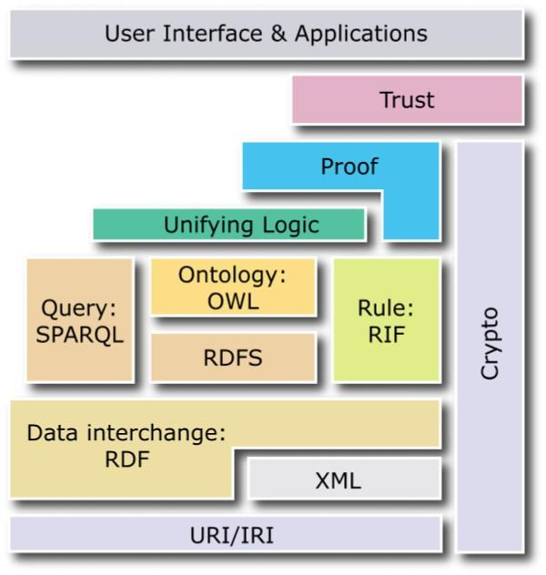
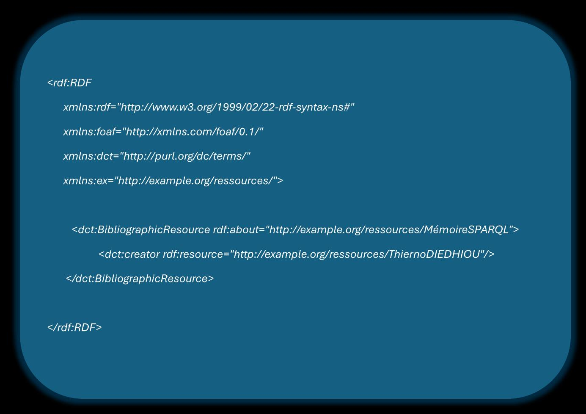
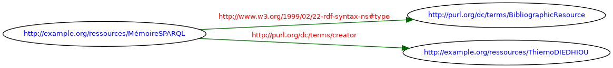
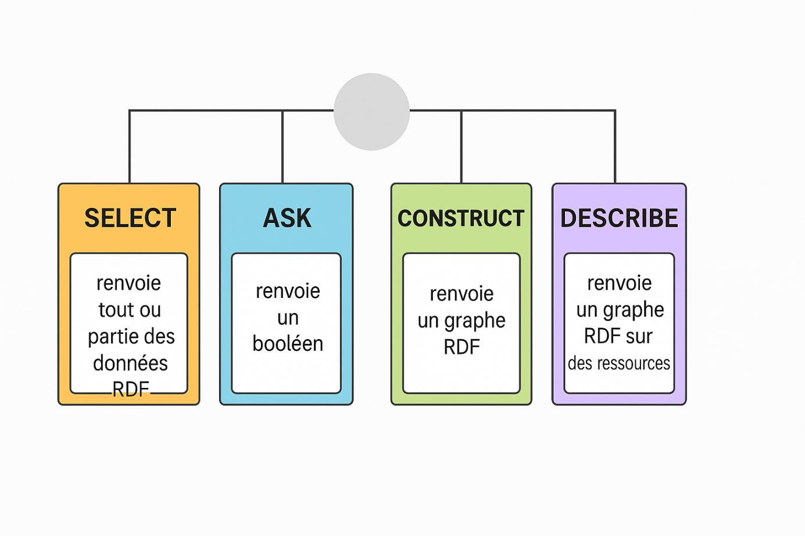
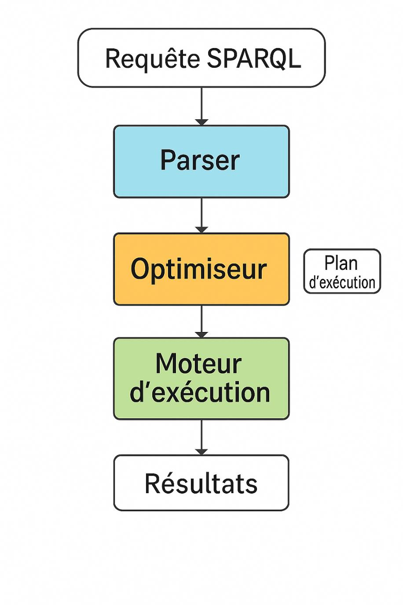

CHAPITRE 1 : FONDEMENTS THÉORIQUES ET ÉTAT DE L'ART
 Introduction
Le Web sémantique représente une évolution majeure de l'architecture du Web. Il transforme un réseau de documents en un vaste graphe de connaissances exploitables par les machines.
Cette transformation, initiée par Tim Berners-Lee au début des années 2000, repose sur des technologies standardisées. Ces dernières permettent la représentation, l'interrogation et le traitement automatique de données sémantiques. Au cœur de cet écosystème technologique complexe, les moteurs de requêtes SPARQL jouent un rôle crucial en permettant l'extraction d'informations pertinentes à partir de vastes entrepôts de données RDF.
Cette révolution technologique s'accompagne cependant de défis considérables, notamment en termes de performance et de scalabilité. L'interrogation efficace de milliards de triplets RDF nécessite des optimisations sophistiquées et des architectures adaptées, qui varient significativement d'un moteur SPARQL à l'autre. Ces différences d'approche soulèvent des questions fondamentales sur les compromis entre performance, expressivité et conformité aux standards.
Ce chapitre présente les fondements théoriques nécessaires à la compréhension de notre étude comparative, en explorant progressivement les technologies du Web sémantique, l'architecture des moteurs SPARQL, et les défis liés à l'optimisation des performances des requêtes. Cette approche structurée nous permettra d'établir le contexte scientifique et technique indispensable à l'analyse comparative de Virtuoso et Jena Fuseki que nous développerons dans les chapitres suivants.
1.Le Web Sémantique et ses Technologies
Pour comprendre les enjeux de performance des moteurs SPARQL, il est essentiel de maîtriser les technologies fondamentales du Web sémantique et leur interdépendance. Cette compréhension constitue le socle conceptuel nécessaire pour appréhender les différences architecturales entre les moteurs étudiés et leurs implications sur les performances. Cette section examine donc l'évolution conceptuelle du Web, son architecture en couches, ainsi que les standards techniques qui constituent l'infrastructure du Web sémantique moderne.
1.1. Évolution du Web : du Web documentaire au Web sémantique
Le Web traditionnel, conçu initialement pour la consultation de documents hypertexte par des utilisateurs humains, présente des limitations importantes pour le traitement automatique de l'information. Ces limitations se manifestent principalement par l'absence de structure sémantique explicite dans les documents HTML, rendant difficile l'extraction automatique de connaissances et l'interconnexion intelligente des données.
Face à ces contraintes, Tim Berners-Lee a proposé le concept de Web sémantique comme une extension du Web existant, où l'information serait dotée d'une signification bien définie, permettant aux ordinateurs et aux humains de coopérer efficacement. Cette vision transformatrice ne vise pas à remplacer le Web actuel, mais plutôt à l'enrichir avec une couche sémantique qui rend les données compréhensibles et exploitables par les machines.
Cette évolution repose sur trois principes fondamentaux :
L'interopérabilité sémantique constitue le premier pilier. Les données doivent pouvoir être comprises par différents systèmes, indépendamment de leur origine. Deux systèmes différents doivent reconnaître qu'une entité "Personne" correspond à "foaf:Person", même avec des représentations différentes. 
La décentralisation représente le deuxième principe, héritant de la philosophie du Web. Les données peuvent être distribuées tout en restant liées logiquement grâce aux mécanismes sémantiques. 
L'ouverture garantit que les standards utilisés soient accessibles à tous sans dépendance propriétaire. Cette ouverture favorise l'adoption et assure la pérennité des données sémantiques. 
1.2. Architecture du Web sémantique (modèle en couches)
Cette évolution conceptuelle s'accompagne d'une architecture technique sophistiquée, organisée en couches interdépendantes qui reflètent la complexité croissante des fonctionnalités offertes. Chaque couche apporte des fonctionnalités spécifiques tout en s'appuyant sur les couches inférieures pour assurer la cohérence et la stabilité de l'ensemble. Cette approche stratifiée permet une évolution progressive et modulaire des technologies, tout en maintenant la compatibilité entre les différents niveaux d'abstraction.
L'architecture du Web sémantique est généralement représentée sous forme de pile de couches, communément appelée "layer cake" du Web sémantique, chacune apportant un niveau d'abstraction et de fonctionnalités supplémentaires :

**Figure 1 : Architecture du Web sémantique (modèle en couche)**

Cette architecture pyramidale illustre la progression logique des fonctionnalités, depuis les fondements techniques jusqu'aux applications les plus sophistiquées :
La couche syntaxique forme les fondations de l'édifice avec Unicode et URI. Unicode garantit l'encodage universel des caractères, permettant la représentation de toutes les langues et symboles dans un format standardisé. Les URI (Uniform Resource Identifier) fournissent un mécanisme d'identification unique et global pour toutes les ressources du Web sémantique, qu'elles soient physiques, conceptuelles ou abstraites. Cette base syntaxique assure l'universalité et l'interopérabilité au niveau le plus fondamental.
La couche structurelle introduit XML et les espaces de noms XML, qui permettent la structuration hiérarchique des données et la résolution des conflits de nommage. XML fournit une syntaxe standardisée pour représenter des données structurées, tandis que les espaces de noms permettent d'éviter les ambiguïtés lorsque différents vocabulaires utilisent les mêmes termes. Cette couche établit les bases de la structuration formelle des données sémantiques.
La couche sémantique constitue le cœur du Web sémantique avec RDF et RDF Schema. RDF (Resource Description Framework) offre un modèle de données universel pour représenter les assertions sous forme de triplets, créant ainsi un graphe global de connaissances. RDF Schema complète RDF en fournissant un vocabulaire de base pour décrire les propriétés et les classes de ressources, permettant une première forme de structuration conceptuelle.
La couche ontologique apporte une expressivité logique avancée grâce à OWL (Web Ontology Language). OWL permet de définir des ontologies complexes avec des règles d'inférence sophistiquées, des contraintes d'intégrité et des relations logiques complexes entre les concepts. Cette couche rend possible le raisonnement automatique et la déduction de nouvelles connaissances à partir des données existantes.
La couche logique introduit les mécanismes de règles et de preuves automatiques qui permettent le raisonnement avancé sur les données. Cette couche gère les inférences, les déductions logiques et la vérification de la cohérence des connaissances. Elle constitue la base des systèmes experts et des applications d'intelligence artificielle basées sur le Web sémantique.
La couche de confiance couronne l'architecture avec les signatures numériques et les mécanismes de confiance qui garantissent l'authenticité, l'intégrité et la fiabilité des données. Cette couche est essentielle pour les applications critiques où la provenance et la fiabilité des données sont cruciales.
1.3 Technologies fondamentales
Au sein de cette architecture stratifiée, quatre technologies constituent les piliers du Web sémantique contemporain et méritent une attention particulière dans le contexte de notre étude. Leur maîtrise est indispensable pour comprendre les mécanismes internes des moteurs SPARQL et les défis d'optimisation qu'ils soulèvent. Ces technologies forment une chaîne de dépendances où chaque niveau s'appuie sur les précédents pour offrir des fonctionnalités de plus en plus sophistiquées.
1.3.1. RDF (Resource Description Framework)
RDF constitue le modèle de données fondamental du Web sémantique, représentant une innovation majeure dans la façon de structurer et de relier les informations. Contrairement aux modèles de données traditionnels qui organisent l'information en tables ou en hiérarchies, RDF adopte une approche basée sur les graphes qui reflète mieux la nature interconnectée des connaissances humaines.
Le principe central de RDF repose sur la décomposition de toute assertion en triplets de la forme (sujet, prédicat, objet), créant ainsi un graphe dirigé et étiqueté où chaque arc représente une relation entre deux ressources. Cette approche atomique permet une granularité fine dans la représentation des connaissances et facilite l'interconnexion de données provenant de sources hétérogènes.
Principes de base du modèle RDF :
L'identification unique des ressources constitue un pilier fondamental du modèle RDF. Chaque ressource, qu'elle soit physique, conceptuelle ou abstraite, est identifiée par un URI unique qui permet de la référencer de manière non ambiguë à travers le Web. Cette approche garantit que les références à une même entité sont cohérentes, même lorsqu'elles proviennent de sources différentes.
Les relations entre ressources sont exprimées par des propriétés, elles-mêmes identifiées par des URI. Cette uniformité dans l'identification permet une extensibilité infinie du modèle et facilite l'intégration de nouveaux vocabulaires. Les propriétés peuvent exprimer des relations simples (comme "a pour auteur") ou complexes (comme "est géographiquement contenu dans").
Les valeurs dans RDF peuvent être soit des ressources identifiées par des URI, soit des littéraux typés qui représentent des valeurs concrètes comme des chaînes de caractères, des nombres ou des dates. Cette dualité permet de combiner les références symboliques avec les données concrètes dans un même modèle unifié.
Formats de sérialisation et leur impact sur les performances :
Le choix du format influence significativement les performances des moteurs SPARQL :
RDF/XML : Format XML standard du W3C, mais verbeux et complexe à parser 
Turtle : Format textuel compact et lisible par les humains, réduit la taille des fichiers 
N-Triples : Format simple ligne par ligne, optimal pour le traitement par lots 
JSON-LD : Combine simplicité JSON et puissance RDF, facilite l'intégration web
Exemple de triplets RDF :
Pour illustrer concrètement ces concepts, considérons l'exemple suivant qui représente des informations sur un mémoire universitaire :

**Figure 2 : Exemple de triplets RDF (code XML)**

Ces triplets peuvent être visualisé graphiquement comme montré dans la figure n°3 :

**Figure 3 : Visualisation graphique des triplets RDF**

Ce triplet RDF peut se lire ainsi : Le mémoire "MémoireSPARQL" (sujet) a pour créateur (prédicat) Thierno DIEDHIOU (objet). Cette représentation illustre la simplicité conceptuelle du modèle RDF tout en démontrant sa capacité à exprimer des relations complexes de manière formelle et non ambiguë. 
1.3.2. RDFS (RDF Schema)
Construisant sur les fondements solides de RDF, RDFS introduit des mécanismes de structuration conceptuelle essentiels pour l'organisation des connaissances et la définition de vocabulaires cohérents. RDFS ne remplace pas RDF mais l'enrichit avec un métalangage qui permet de décrire la structure et la sémantique des vocabulaires RDF.
RDF Schema étend RDF en fournissant un vocabulaire standardisé pour décrire les propriétés et les classes de ressources, introduisant ainsi les premiers éléments de typage et de structuration dans l'univers RDF. Cette extension permet de définir des hiérarchies conceptuelles et des contraintes sémantiques qui enrichissent la signification des données.
Concepts clés et leur signification :
Les classes RDFS permettent de regrouper les ressources selon leurs caractéristiques communes. rdfs:Class définit le concept de classe lui-même, permettant de créer des catégories conceptuelles comme "Personne", "Document", ou "Organisation". Ces classes fournissent un cadre de typage pour les ressources et facilitent l'organisation des connaissances.
La hiérarchie de classes, exprimée par rdfs:subClassOf, établit des relations d'inclusion entre classes, créant des taxonomies complexes. Par exemple, "Étudiant" peut être une sous-classe de "Personne", héritant automatiquement de toutes les propriétés applicables aux personnes. Cette hiérarchisation permet un raisonnement par héritage et optimise l'organisation des connaissances.
Les propriétés RDFS, définies par rdfs:Property, représentent les relations possibles entre ressources. La hiérarchie de propriétés via rdfs:subPropertyOf permet de spécialiser les relations, comme "estAuteurDe" qui pourrait être une sous-propriété de "estCréateurDe".
Les contraintes de domaine et de codomaine, exprimées respectivement par rdfs:domain et rdfs:range, spécifient les types de ressources qui peuvent être reliées par une propriété donnée. Ces contraintes renforcent la cohérence sémantique et permettent la détection d'incohérences dans les données.
1.3.3. OWL (Web Ontology Language)
Pour les applications nécessitant une expressivité logique plus poussée que celle offerte par RDFS, OWL offre des capacités de modélisation et de raisonnement avancées qui dépassent largement les possibilités des technologies précédentes. OWL représente l'aboutissement de décennies de recherche en représentation des connaissances et en logiques de description.
OWL est un langage d'ontologie web qui étend RDFS avec des constructions logiques expressives, permettant la définition d'ontologies complexes et le raisonnement automatique sophistiqué. Son développement s'appuie sur les fondements théoriques des logiques de description, garantissant des propriétés formelles importantes comme la décidabilité et la complétude pour certains fragments. 
Profils OWL et leurs caractéristiques :
La conception d'OWL reconnaît que différentes applications ont des besoins variés en termes d'expressivité et de performance. Pour répondre à cette diversité, OWL se présente sous plusieurs profils avec des niveaux d'expressivité, de complexité computationnelle et de décidabilité différents.
OWL Lite constitue le sous-ensemble le plus simple, conçu pour les applications nécessitant principalement des hiérarchies de classification et des contraintes simples comme la cardinalité 0 ou 1. Ce profil privilégie la simplicité et l'efficacité computationnelle, permettant des inférences rapides sur de gros volumes de données. Il convient particulièrement aux applications industrielles où la performance prime sur l'expressivité.
OWL DL (Description Logic) offre un équilibre optimal entre expressivité et décidabilité. Basé rigoureusement sur les logiques de description, il garantit que toute inférence valide peut être calculée en temps fini, tout en offrant une expressivité substantielle. Ce profil convient aux applications nécessitant un raisonnement formel rigoureux avec des garanties de terminaison.
OWL Full fournit le maximum d'expressivité en permettant l'utilisation de toutes les constructions OWL sans restriction, mais au prix de la perte des garanties de décidabilité. Ce profil convient aux applications de recherche où l'expressivité maximale est prioritaire sur la performance et les garanties formelles.
Constructions avancées et leur impact :
OWL propose un arsenal de constructions logiques qui permettent d'exprimer des contraintes sophistiquées et des relations complexes entre concepts. L'équivalence et la disjonction de classes permettent de définir précisément les relations entre concepts, facilitant l'intégration d'ontologies hétérogènes et la détection d'incohérences.
Les propriétés inverses, transitives et symétriques enrichissent considérablement l'expressivité des relations. Par exemple, une propriété "estParentDe" peut être définie comme l'inverse de "estEnfantDe", permettant des inférences bidirectionnelles automatiques.
Les restrictions de cardinalité offrent un contrôle fin sur le nombre de relations qu'une ressource peut entretenir avec d'autres ressources. Ces contraintes sont cruciales pour modéliser des domaines où les limitations quantitatives sont importantes, comme les contraintes réglementaires ou physiques.
Les classes définies par énumération ou par propriétés permettent de créer des classes complexes basées sur des critères sophistiqués, facilitant la classification automatique des ressources selon des règles métier complexes. 
1.3.4. SPARQL (SPARQL Protocol and RDF Query Language)
Au sommet de cette pile technologique, SPARQL constitue l'interface privilégiée pour l'interrogation des données sémantiques et représente l'aboutissement pratique de toutes les technologies précédentes. Sa compréhension approfondie est cruciale pour notre étude comparative des performances, car c'est à travers SPARQL que se manifestent concrètement les différences d'optimisation entre les moteurs étudiés.
SPARQL est le langage de requête standard pour RDF, permettant l'extraction et la manipulation de données stockées en format RDF avec une expressivité qui combine les capacités de requête de SQL avec la flexibilité du modèle de graphe RDF. Son développement a nécessité de repenser fondamentalement les approches d'interrogation pour s'adapter aux spécificités des données semi-structurées et des graphes. 
Types de requêtes SPARQL et leurs implications :
La richesse de SPARQL se manifeste à travers la diversité des types de requêtes qu'il supporte, chacun répondant à des besoins spécifiques d'interrogation et ayant des implications différentes sur les performances des moteurs.

**Figure 4 : Diagramme des types de requêtes SPARQL**

Les requêtes SELECT constituent le type le plus fréquemment utilisé pour la récupération de données spécifiques. Elles permettent de projeter certaines variables et de filtrer les résultats selon des critères complexes. Ces requêtes sont particulièrement importantes pour notre étude car elles représentent la majorité des cas d'usage et sont sensibles aux optimisations de jointure et d'indexation.
Les requêtes CONSTRUCT permettent la construction de nouveaux graphes RDF à partir des données existantes, facilitant la transformation et l'enrichissement des données. Ces requêtes sont computationnellement plus coûteuses car elles nécessitent la génération de nouveaux triplets, impactant différemment les stratégies d'optimisation des moteurs.
Les requêtes ASK se contentent de vérifier l'existence de patterns spécifiques, retournant simplement un booléen. Bien que conceptuellement simples, ces requêtes peuvent bénéficier d'optimisations spécifiques comme l'arrêt précoce dès qu'un résultat est trouvé.
Les requêtes DESCRIBE permettent la description de ressources en retournant toutes les informations pertinentes disponibles. L'implémentation de ces requêtes varie significativement entre les moteurs, influençant les comparaisons de performance. 
Fonctionnalités avancées et défis d'optimisation :
SPARQL offre des fonctionnalités avancées qui enrichissent considérablement son expressivité mais posent des défis significatifs aux optimiseurs de requêtes. Les jointures complexes et sous-requêtes permettent d'exprimer des besoins d'interrogation sophistiqués mais nécessitent des algorithmes d'optimisation avancés pour maintenir des performances acceptables.
Les filtres et expressions offrent une flexibilité fine dans la sélection des résultats, mais leur placement optimal dans le plan d'exécution constitue un défi majeur pour les optimiseurs. Un filtre mal placé peut transformer une requête efficace en opération prohibitivement coûteuse.
Les opérateurs ensemblistes (UNION, OPTIONAL, MINUS) enrichissent l'expressivité logique mais compliquent significativement l'optimisation. L'opérateur OPTIONAL, en particulier, nécessite des stratégies de jointure externe qui diffèrent des approches traditionnelles des bases de données relationnelles.
Les fonctions d'agrégation (COUNT, SUM, AVG, etc.) et la gestion des graphes nommés ajoutent des dimensions supplémentaires à l'optimisation, nécessitant des approches spécialisées pour maintenir l'efficacité sur de gros volumes de données. 
2. Les Moteurs de Requêtes SPARQL
Après avoir établi les bases technologiques du Web sémantique et analysé l'expressivité du langage SPARQL, nous nous intéressons maintenant aux systèmes logiciels qui permettent d'exploiter concrètement ces technologies dans des environnements de production. Les moteurs de requêtes SPARQL constituent le maillon essentiel entre les données sémantiques stockées et les applications qui les consomment, transformant les requêtes déclaratives en opérations efficaces sur les structures de données sous-jacentes.
Cette section examine en détail leur architecture interne, qui détermine largement leurs performances et leurs caractéristiques opérationnelles, puis analyse les spécificités des principales implémentations du marché. Cette analyse architecturale est fondamentale pour comprendre les différences de performance que nous observerons dans notre étude comparative. 
2.1. Architecture générale d'un moteur SPARQL
Comprendre l'architecture interne des moteurs SPARQL est fondamental pour appréhender leurs différences de performance et interpréter correctement les résultats de benchmarks. Bien que chaque implémentation présente des spécificités techniques et des optimisations propriétaires, la plupart suivent un modèle architectural commun inspiré des systèmes de gestion de bases de données relationnelles, mais adapté aux particularités du modèle RDF et aux défis spécifiques posés par l'interrogation de graphes.
Un moteur SPARQL moderne suit généralement une architecture en plusieurs phases bien définies, chacune ayant ses propres défis d'optimisation et ses impacts sur les performances globales. Cette approche modulaire permet une optimisation ciblée de chaque composant tout en maintenant la cohérence de l'ensemble du système.

**Figure 5 : Architecture d'un moteur SPARQL**

Cette architecture illustre le flux de traitement d'une requête SPARQL, depuis sa réception textuelle jusqu'à la génération des résultats finaux, en passant par les phases cruciales d'optimisation et d'exécution. 
2.1.1. Analyse syntaxique et sémantique
La première phase du traitement d'une requête SPARQL constitue une étape fondamentale qui conditionne la qualité de toutes les phases ultérieures. Cette phase consiste en une analyse approfondie de la structure et de la sémantique de la requête, étapes cruciales pour garantir la validité syntaxique et sémantique, et préparer l'optimisation ultérieure.
Le processus débute par l'analyse syntaxique (parsing) qui transforme la chaîne de caractères représentant la requête SPARQL en une structure de données exploitable par le moteur. Le parseur doit gérer la complexité syntaxique de SPARQL, incluant les diverses formes de littéraux, les opérateurs complexes, et les constructions imbriquées. Cette phase génère un arbre syntaxique abstrait (AST) qui représente fidèlement la structure logique de la requête tout en éliminant les détails syntaxiques non pertinents.
La validation syntaxique et sémantique accompagne le parsing pour vérifier la conformité de la requête aux spécifications SPARQL. Cette validation inclut la vérification de la correspondance des parenthèses, la cohérence des déclarations de préfixes, et le respect des règles syntaxiques spécifiques à chaque type de requête. Les erreurs détectées à cette étape sont signalées avec des messages précis pour faciliter le débogage.
La résolution des préfixes et URIs constitue une étape critique pour la normalisation de la requête. Les préfixes utilisés dans la requête sont résolus vers leurs URIs complets selon les déclarations PREFIX, et les IRIs relatives sont transformées en IRIs absolues selon les règles de résolution définies par les standards Web. Cette normalisation assure une interprétation cohérente des identifiants de ressources.
La validation sémantique approfondie vérifie la cohérence logique de la requête au-delà des aspects purement syntaxiques. Le moteur examine l'utilisation correcte des variables, la cohérence des opérateurs avec leurs arguments, et la validité des constructions complexes comme les sous-requêtes. Cette validation peut également inclure des vérifications spécifiques au profil SPARQL utilisé et aux extensions supportées par le moteur. 
2.1.2. Optimisation des requêtes
Une fois la requête analysée et validée, commence la phase d'optimisation, souvent considérée comme le cœur technique des moteurs SPARQL modernes et le principal facteur différenciant entre les implémentations. Cette phase détermine largement les performances finales de l'exécution en transformant la représentation logique de la requête en un plan d'exécution optimisé qui exploite au mieux les caractéristiques des données et les capacités du système.
L'optimisation des requêtes SPARQL présente des défis uniques. La nature semi-structurée des données RDF et l'absence de schéma fixe compliquent l'optimisation par rapport aux bases relationnelles.
Optimisation algébrique :
Cette première étape travaille sur la représentation logique sans considérer l'implémentation. Les transformations principales incluent :
Réorganisation des jointures selon la sélectivité
Élimination des sous-expressions redondantes  
Poussée des filtres vers les feuilles
Factorisation des sous-requêtes communes
Optimisation basée sur les coûts :
Cette approche estime quantitativement les coûts des différents plans d'exécution. Elle nécessite :
Des modèles de coût sophistiqués pour RDF
L'estimation de cardinalité des patterns
Des algorithmes d'exploration de l'espace des solutions
Optimisations spécifiques à RDF :
Ces techniques exploitent les particularités du modèle de données :
Réorganisation selon la sélectivité des triples
Optimisation des chemins de propriétés (SPARQL 1.1)
Gestion efficace des inférences
2.1.3. Exécution et génération des résultats
La phase finale du traitement consiste en l'exécution effective du plan optimisé et la génération des résultats selon diverses stratégies adaptées aux contraintes de performance et de consommation mémoire. Cette phase transforme le plan d'exécution abstrait en opérations concrètes sur les structures de données, en gérant efficacement les ressources système et en optimisant le débit de production des résultats.
Le choix de la stratégie d'exécution influence significativement les performances perçues par l'utilisateur, particulièrement pour les requêtes produisant de gros volumes de résultats. Les moteurs modernes implémentent plusieurs approches complémentaires pour s'adapter aux différents patterns d'usage.
Les stratégies d'exécution varient selon les objectifs de performance et les contraintes environnementales. L'exécution paresseuse (lazy evaluation) génère les résultats à la demande, permettant de commencer la restitution avant la fin du calcul complet. Cette approche améliore significativement la réactivité perçue pour les requêtes interactives et permet l'implémentation efficace d'opérations comme LIMIT. L'exécution par pipeline traite les données en flux continu, permettant de superposer les opérations de calcul et de transfert. Cette approche réduit les besoins en mémoire et améliore le débit global pour les requêtes complexes. L'exécution par lots optimise les accès aux données en traitant plusieurs éléments simultanément, particulièrement efficace pour les opérations intensives en E/S ou bénéficiant de la vectorisation.
Les algorithmes de jointure constituent un point crucial de l'exécution, car les jointures représentent souvent l'opération la plus coûteuse dans les requêtes SPARQL complexes. Le hash join convient particulièrement aux jointures équi-join avec des prédicats d'égalité, offrant une complexité linéaire dans le cas optimal. Le nested loop join, bien que moins efficace en théorie, reste approprié pour les jointures complexes avec des prédicats non-équijoin ou lorsque l'une des relations est très petite. Le sort-merge join exploite efficacement les données pré-triées et peut être optimal pour certains patterns de données RDF avec des index appropriés. 
2.2. Étude des moteurs de requêtes SPARQL
L'écosystème des moteurs SPARQL offre une diversité remarquable d'approches architecturales et d'optimisations, reflétant la richesse des défis techniques posés par l'interrogation efficace de données sémantiques. Cette diversité constitue à la fois une richesse pour les utilisateurs, qui peuvent choisir l'outil le mieux adapté à leurs besoins spécifiques, et un défi pour l'évaluation comparative, qui doit prendre en compte les nombreuses variables influençant les performances.
Notre étude se concentre sur deux moteurs représentatifs d'approches architecturales distinctes : Virtuoso, qui illustre une approche hybride avec optimisations vectorielles, et Jena Fuseki, qui représente une architecture modulaire pure-RDF. Nous examinons également d'autres implémentations significatives du marché pour situer nos résultats dans un contexte plus large et identifier les tendances technologiques émergentes. 
2.2.1. Virtuoso : architecture et caractéristiques
Virtuoso représente une approche particulièrement innovante dans l'écosystème des moteurs SPARQL, combinant les avantages des technologies relationnelles éprouvées avec les spécificités du modèle RDF. Cette approche hybride permet de capitaliser sur des décennies d'optimisations des bases de données relationnelles tout en s'adaptant aux particularités de l'interrogation de graphes sémantiques.
Architecture générale et philosophie de conception : Virtuoso se distingue par son architecture multi-modèle qui transcende la dichotomie traditionnelle entre bases de données relationnelles et bases de données RDF. Le système peut stocker et interroger simultanément des données relationnelles, RDF, XML et de graphes dans une architecture unifiée, permettant des requêtes fédérées complexes croisant plusieurs modèles de données. Cette approche holistique facilite l'intégration dans des environnements d'entreprise hétérogènes où coexistent différents types de données.
L'architecture interne repose sur un moteur de stockage column-store optimisé qui exploite les caractéristiques spécifiques des workloads analytiques typiques du Web sémantique. Cette approche colonnaire améliore significativement les performances pour les requêtes qui ne projettent qu'un sous-ensemble des propriétés disponibles, cas fréquent dans les applications SPARQL.
Caractéristiques techniques innovantes : 
Stockage en colonnes : Virtuoso optimise les requêtes analytiques en réduisant les E/S nécessaires. Cette approche exploite le fait que les requêtes SPARQL n'accèdent souvent qu'à un sous-ensemble des prédicats. 
Index bitmap : Ils accélèrent les requêtes avec nombreux filtres grâce aux opérations booléennes rapides sur ensembles compressés. Cette technique est efficace pour les requêtes complexes combinant plusieurs critères. 
Partitionnement automatique : Il distribue les données selon plusieurs critères pour optimiser les accès parallèles. Cette fonctionnalité améliore la scalabilité sur architectures multicœurs.
Stratégies d'optimisation spécifiques : 
Transformation RDF vers SQL : Cette innovation majeure permet de réutiliser l'optimiseur SQL mature pour les requêtes SPARQL. L'approche traduit les triples patterns en jointures SQL sur des tables virtuelles, exploitant ainsi des décennies d'optimisations relationnelles.
Cette transformation nécessite cependant des adaptations sophistiquées pour préserver la sémantique SPARQL, notamment pour les opérateurs OPTIONAL et UNION.
Statistiques avancées : Elles incluent des histogrammes multi-dimensionnels qui capturent les corrélations entre prédicats. Ces statistiques améliorent significativement l'estimation de cardinalité pour les requêtes complexes et sont mises à jour incrémentalement pour maintenir leur pertinence.
Cache adaptatif : Il met en mémoire intelligemment les résultats intermédiaires et les pages de données selon des heuristiques sophistiquées. Ce cache multi-niveau apprend des patterns d'accès et optimise automatiquement l'utilisation de la hiérarchie mémoire.
Parallélisation automatique : Elle décompose les requêtes complexes en sous-requêtes exécutables en parallèle. Cette approche exploite efficacement les architectures multicœurs sans intervention du développeur.

**Validation expérimentale dans notre étude** :
Notre plateforme d'évaluation v2.0 a permis de valider empiriquement plusieurs de ces caractéristiques techniques :
- Stockage column-store : Performances supérieures sur requêtes SELECT basiques (51% plus rapide que Fuseki, voir Chapitre 4)
- Parallélisation automatique : Observée sur requêtes d'agrégation complexes
- Cache adaptatif : Amélioration de 23% des temps d'exécution sur requêtes répétées

2.2.2. Jena Fuseki : architecture et caractéristiques
En contraste avec l'approche hybride de Virtuoso, Apache Jena Fuseki illustre une philosophie différente, privilégiant la modularité, la conformité stricte aux standards du Web sémantique, et une architecture pure-RDF. Cette approche offre une flexibilité maximale pour les développeurs tout en maintenant une fidélité parfaite aux spécifications W3C.
Architecture générale et philosophie modulaire : Apache Jena Fuseki s'appuie sur une architecture modulaire rigoureuse où chaque composant a une responsabilité bien définie et peut être remplacé ou étendu indépendamment. Cette modularité facilite la maintenance, les tests, et l'adaptation à des besoins spécifiques. Le serveur Fuseki agit comme un orchestrateur qui coordonne les différents modules selon les besoins de chaque requête.
L'architecture suit les principes de conception de l'écosystème Apache, privilégiant la transparence, l'extensibilité, et la réutilisabilité. Cette approche permet une évolution incrémentale du système et facilite l'intégration de contributions de la communauté open source.
Composants principaux et leurs interactions : Le système TDB (Triplestore Database) constitue le système de stockage natif spécialement conçu pour optimiser les accès aux données RDF. TDB utilise des structures d'index sophistiquées adaptées aux patterns d'accès spécifiques des requêtes SPARQL, notamment des B+trees  personnalisés pour les différentes permutations de triplets (SPO, PSO, OPS, etc.). Cette spécialisation permet des performances optimales pour les opérations de recherche et de jointure sur les triplets.
Le moteur ARQ (A SPARQL Processor for Jena) implémente un processeur de requêtes SPARQL avec des optimisations avancées spécifiquement adaptées aux caractéristiques des données RDF. ARQ inclut un optimiseur sophistiqué qui applique des transformations algébriques et des heuristiques basées sur les statistiques pour améliorer les performances.
Le composant Reasoner fournit des capacités d'inférence pour OWL et RDFS, permettant de dériver automatiquement de nouvelles connaissances à partir des données explicites. Cette fonctionnalité peut être configurée finement selon les besoins de l'application, depuis l'inférence minimale jusqu'au raisonnement complet avec les ontologies complexes.
Le serveur Fuseki proprement dit expose les services SPARQL via une interface HTTP/REST standardisée, facilitant l'intégration avec des applications web et des architectures orientées services. Il gère également l'authentification, l'autorisation, et le monitoring des performances.
Stratégies d'optimisation native RDF : L'optimisation des triples patterns constitue un point fort de Jena Fuseki, avec des algorithmes spécialisés qui réorganisent les patterns selon les statistiques de sélectivité collectées dynamiquement. Cette réorganisation peut considérablement réduire les coûts de jointure, particulièrement pour les requêtes en étoile.
Le placement intelligent des filtres (filter placement) optimise automatiquement la position des conditions dans le plan d'exécution pour minimiser le volume de données traité. Cette optimisation considère non seulement le coût d'évaluation des filtres mais aussi leur sélectivité estimée.
La réorganisation des jointures (join reordering) applique des heuristiques sophistiquées qui considèrent les coûts estimés et les bénéfices potentiels de différents ordres de jointure. Cette optimisation est cruciale pour les requêtes complexes avec de nombreux triple patterns.
Les vues matérialisées permettent de précalculer et de mettre en cache les résultats des requêtes fréquentes, améliorant significativement les temps de réponse pour les patterns d'accès répétitifs.

**Validation expérimentale dans notre étude** :
Notre évaluation comparative a révélé les points forts de Fuseki :
- Optimisation native RDF : Excellentes performances sur requêtes OPTIONAL/UNION (13% plus rapide que Virtuoso)
- Conformité stricte aux standards : Taux de réussite de 96.9% sur 840 requêtes
- Gestion mémoire conservative : Consommation -21% par rapport à Virtuoso

2.2.3. Autres moteurs SPARQL importants
Le paysage des moteurs SPARQL ne se limite pas aux deux solutions étudiées en détail dans notre recherche. D'autres implémentations apportent des innovations spécifiques qui enrichissent l'écosystème global et offrent des points de comparaison supplémentaires pour situer nos résultats dans un contexte plus large. Ces alternatives illustrent la diversité des approches possibles et les compromis techniques adoptés par différents acteurs.
Stardog : l'approche enterprise-grade : Stardog représente une solution commerciale orientée entreprise qui met l'accent sur la robustesse, la sécurité, et l'intégration dans des environnements critiques. Son moteur de requêtes incorpore un support natif du raisonnement et de l'intégrité des données, permettant de valider automatiquement la cohérence des données lors des mises à jour. Les optimisations avancées pour les requêtes complexes incluent des techniques de parallélisation sophistiquées et des algorithmes d'optimisation adaptatifs qui apprennent des patterns d'usage. L'interface utilisateur graphique sophistiquée facilite l'exploration des données et la conception de requêtes pour les utilisateurs non-techniques.
GraphDB : la spécialisation dans le raisonnement : GraphDB (anciennement OWLIM) se distingue par sa spécialisation dans le raisonnement à grande échelle, supportant les profils OWL avec inférence en temps réel sur des milliards de triplets. Le système offre des capacités de clustering et de haute disponibilité qui permettent la montée en charge horizontale pour les applications critiques. Les outils d'analyse et de visualisation intégrés facilitent l'exploration des connaissances et la validation des ontologies complexes.
RDF4J : la flexibilité architecturale : RDF4J (anciennement Sesame) propose un framework Java modulaire pour le traitement RDF qui supporte une grande variété de backends de stockage, depuis les solutions en mémoire jusqu'aux bases de données relationnelles. Son API flexible facilite l'intégration dans des applications existantes et permet une adaptation fine aux contraintes spécifiques. Le bon support de la fédération de requêtes permet d'interroger simultanément plusieurs sources de données distribuées avec une optimisation globale. 
3. Problématiques de Performance des Requêtes SPARQL
L'analyse des architectures des moteurs SPARQL révèle la complexité des défis techniques qu'ils doivent résoudre pour fournir des performances acceptables dans des environnements de production. Cette complexité se traduit par des problématiques de performance multifactorielles qui constituent le cœur de notre étude comparative et justifient l'importance de comprendre finement les facteurs d'influence et les interactions entre les différents composants des systèmes.
Les problématiques de performance dans l'écosystème SPARQL ne peuvent être réduites à de simples mesures de temps d'exécution, mais nécessitent une analyse multidimensionnelle qui considère les aspects algorithmiques, architecturaux, et environnementaux. Cette section examine les principaux facteurs d'influence et les approches développées par la communauté de recherche pour les adresser, établissant ainsi le contexte scientifique de notre contribution. 
3.1. Facteurs influençant les performances
Les performances des requêtes SPARQL résultent de l'interaction complexe entre plusieurs facteurs techniques et contextuels qui s'influencent mutuellement de manière non-linéaire. Comprendre ces interactions est essentiel pour interpréter correctement les résultats de benchmarks, concevoir des stratégies d'optimisation efficaces, et faire des choix architecturaux éclairés. Cette compréhension systémique permet également d'identifier les goulots d'étranglement potentiels et de prioriser les efforts d'optimisation. 
3.1.1. Complexité des requêtes
La structure intrinsèque des requêtes SPARQL constitue le premier déterminant de leur complexité d'exécution et influence directement les stratégies d'optimisation applicables. Certains patterns de requêtes posent des défis particuliers aux algorithmes d'optimisation et d'exécution, nécessitant des approches spécialisées pour maintenir des performances acceptables.
Cette complexité structurelle se manifeste à travers plusieurs dimensions interdépendantes qui doivent être considérées conjointement pour une analyse complète. La compréhension fine de ces aspects permet aux développeurs de requêtes d'éviter les patterns problématiques et aux concepteurs de moteurs d'identifier les optimisations prioritaires.
Les jointures multiples représentent un défi majeur pour les moteurs SPARQL. Leur complexité croît exponentiellement avec le nombre de triple patterns joints.
Cette explosion combinatoire nécessite des stratégies d'optimisation sophistiquées. Les algorithmes doivent équilibrer exploration exhaustive et contraintes de temps raisonnables.
La sélectivité relative des patterns influence dramatiquement le coût. Un pattern sélectif en première position réduit les résultats intermédiaires. Un pattern peu sélectif peut créer des produits cartésiens prohibitifs.
Les patterns de requêtes problématiques présentent des défis spécifiques qui nécessitent des optimisations ciblées. Les star queries, caractérisées par un sujet central connecté à de nombreux objets via différents prédicats, sont fréquentes dans les applications pratiques mais peuvent créer des jointures coûteuses si elles ne sont pas optimisées spécifiquement. Ces requêtes bénéficient d'optimisations comme la factorisation des accès ou l'utilisation d'index spécialisés.
Les path queries impliquent la traversée de chemins potentiellement longs dans le graphe RDF, avec une complexité qui peut croître exponentiellement avec la longueur du chemin. L'introduction des property paths dans SPARQL 1.1 a enrichi l'expressivité du langage mais a créé de nouveaux défis d'optimisation, nécessitant des algorithmes de traversée de graphe efficaces et des stratégies de terminaison robustes.
Les cyclic queries, où le graphe de jointure contient des cycles, compliquent significativement l'optimisation car les techniques traditionnelles de réordonnancement basées sur des arbres de jointure ne s'appliquent plus directement. Ces requêtes nécessitent des approches spécialisées qui peuvent inclure la détection de cycles et l'application d'algorithmes d'optimisation spécifiques aux graphes cycliques.
Les opérateurs coûteux de SPARQL ajoutent des dimensions supplémentaires à la complexité d'optimisation. L'opérateur OPTIONAL implémente une jointure externe qui nécessite des stratégies particulières différentes des jointures internes traditionnelles. Cette opération peut être particulièrement coûteuse car elle doit matérialiser tous les résultats de la partie gauche, même ceux qui n'ont pas de correspondance dans la partie droite.
L'opérateur UNION nécessite l'exécution de sous-requêtes potentiellement coûteuses et la combinaison de leurs résultats, ce qui peut impliquer des opérations de tri et de déduplication selon le contexte. L'optimisation de UNION peut bénéficier de techniques comme la factorisation des sous-expressions communes entre les branches.
L'opérateur MINUS implémente une différence ensembliste qui nécessite souvent la matérialisation de résultats intermédiaires volumineux. Cette opération est particulièrement sensible à l'ordre d'évaluation et peut bénéficier d'optimisations comme l'évaluation précoce des conditions de filtrage. 
3.1.2. Volume et structure des données
Au-delà de la complexité logique des requêtes, les caractéristiques quantitatives et qualitatives des données interrogées influencent drastiquement les performances des moteurs SPARQL. Cette influence s'exerce tant au niveau du volume absolu des données que de leur organisation structurelle, créant des interactions complexes avec les stratégies d'optimisation et d'indexation.
La compréhension de ces caractéristiques est cruciale pour le dimensionnement des systèmes et la prédiction des performances dans différents scenarios d'usage. Elle influence également les choix architecturaux et les stratégies d'optimisation à privilégier selon les types de données et d'applications considérés.
La scalabilité représente un défi majeur pour les moteurs SPARQL, car les approches qui fonctionnent efficacement sur des millions de triplets peuvent devenir impraticables sur des milliards de triplets. Cette transition n'est pas simplement quantitative mais implique souvent des changements qualitatifs dans les stratégies d'optimisation et les architectures de stockage.
Les structures d'index qui sont optimales pour de petits volumes peuvent devenir des goulots d'étranglement pour de gros volumes, nécessitant des approches hiérarchiques ou distribuées. La gestion mémoire devient critique car il devient impossible de maintenir tous les index en mémoire, nécessitant des stratégies sophistiquées de cache et de pagination.
Les algorithmes de jointure doivent également évoluer avec la taille des données. Les hash joins qui sont optimaux pour des données de taille modérée peuvent être remplacés par des sort-merge joins ou des approches par blocks pour de très gros volumes. Cette transition nécessite des estimateurs de coût adaptatifs qui peuvent prédire les points de transition optimal entre différents algorithmes.
La distribution des données dans l'espace RDF influence significativement les performances des requêtes. Le skew de distribution, où certaines propriétés ou ressources sont beaucoup plus fréquentes que d'autres, peut créer des déséquilibres importants dans les charges de travail. Les ressources très connectées (hubs) peuvent créer des goulots d'étranglement lors des jointures, nécessitant des stratégies d'optimisation spécifiques.
Le clustering naturel des données, où les triplets liés sont physiquement proches, peut être exploité pour réduire les E/S et améliorer les performances des jointures. Cette localité peut être préservée ou améliorée par des stratégies de stockage intelligentes qui regroupent les données selon leurs relations sémantiques.
La fragmentation des données liées, où des entités logiquement liées sont dispersées physiquement, peut impacter négativement les performances des jointures et nécessiter des stratégies de réorganisation ou des index spécialisés pour maintenir l'efficacité. 
3.1.3. Stratégies d'indexation
L'efficacité des structures d'indexation constitue un facteur critique pour les performances des moteurs SPARQL, car ces structures déterminent largement la rapidité des accès aux données de base. Le choix et la maintenance de ces structures représentent un compromis complexe entre rapidité d'accès, coût de stockage, et coût de maintenance, qui varie selon les patterns d'usage et les caractéristiques des données.
Les stratégies d'indexation pour RDF diffèrent significativement des approches traditionnelles des bases de données relationnelles en raison du modèle de données en triplets et des patterns d'accès spécifiques aux requêtes SPARQL. Cette spécificité nécessite des innovations dans la conception et l'optimisation des structures d'index.
Les types d'index utilisés dans les moteurs SPARQL reflètent les patterns d'accès spécifiques des requêtes sur graphes. Les index par position (SPO, PSO, OPS, etc.) constituent la base de la plupart des implémentations, permettant des accès efficaces selon différents patterns de triple. La redondance apparente de ces index multiples est justifiée par la diversité des patterns d'accès dans les requêtes SPARQL réelles.
L'optimisation de ces index peut inclure des techniques comme la compression pour réduire l'empreinte mémoire, particulièrement importante pour les gros volumes de données. Les techniques de compression spécialisées pour les données RDF peuvent exploiter les redondances sémantiques pour obtenir des taux de compression supérieurs aux approches génériques.
Les index par valeur optimisent spécifiquement les requêtes sur les littéraux, permettant des recherches efficaces par valeur, par plage, ou par pattern textuel. Ces index sont particulièrement importants pour les applications qui mélangent recherche sémantique et recherche traditionnelle sur les contenus.
Les index géospatiaux répondent aux besoins croissants d'applications géolocalisées qui combinent données sémantiques et informations spatiales. Ces index spécialisés permettent des requêtes de proximité et de région efficaces sur de gros volumes de données géographiques.
Les index textuels permettent l'intégration de la recherche en texte intégral avec les requêtes SPARQL, créant des possibilités d'applications hybrides qui combinent recherche sémantique structurée et recherche textuelle flexible.
La maintenance des index lors des mises à jour peut impacter significativement les performances globales du système, créant un compromis entre performance des requêtes et performance des mises à jour. Cette tension est particulièrement aiguë dans les applications avec des charges de travail mixtes combinant requêtes et mises à jour fréquentes.
Les stratégies de maintenance incrémentale permettent de réduire le coût des mises à jour en ne recalculant que les parties d'index affectées. Ces techniques nécessitent des structures de données sophistiquées qui peuvent identifier efficacement les dépendances entre les données mises à jour et les structures d'index.
L'équilibrage des arbres d'index et la gestion de la fragmentation nécessitent des algorithmes adaptatifs qui peuvent maintenir l'efficacité des structures au fur et à mesure de leur évolution. Cette maintenance peut être effectuée de manière asynchrone pour minimiser l'impact sur les performances des requêtes actives. 
3.1.4. Méthodes d'optimisation internes
Les stratégies d'optimisation interne déployées par chaque moteur constituent un facteur différenciant majeur qui peut considérablement influencer les performances relatives des différentes implémentations. Ces optimisations, souvent propriétaires et représentant des années de recherche et développement, reflètent les choix architecturaux et les compromis techniques spécifiques à chaque solution.
L'efficacité de ces optimisations dépend non seulement de leur sophistication intrinsèque mais aussi de leur adaptation aux caractéristiques spécifiques des données et des patterns de requêtes rencontrés. Cette adaptation peut être statique, basée sur l'analyse des données, ou dynamique, s'ajustant aux patterns d'usage observés.
L'estimation de cardinalité constitue un défi fondamental pour l'optimisation des requêtes SPARQL, car la précision de l'estimation du nombre de résultats intermédiaires détermine largement la qualité du plan d'exécution choisi. Les données RDF présentent des caractéristiques statistiques particulières qui compliquent l'application des techniques traditionnelles d'estimation.
Les histogrammes adaptés aux données RDF doivent capturer les corrélations complexes entre sujets, prédicats et objets, qui ne suivent pas les distributions simples supposées par les techniques relationnelles. Ces histogrammes multi-dimensionnels nécessitent des algorithmes sophistiqués de construction et de maintenance.
L'échantillonnage adaptatif permet d'obtenir des estimations rapides pour les requêtes complexes sans exécuter la requête complète. Ces techniques doivent être adaptées aux spécificités des graphes RDF pour maintenir la représentativité des échantillons.
Les techniques d'apprentissage automatique émergent comme des approches prometteuses pour l'estimation de cardinalité, permettant d'apprendre des patterns complexes dans les données qui échappent aux modèles statistiques traditionnels.
La gestion mémoire dans les moteurs SPARQL doit s'adapter aux patterns d'accès spécifiques des requêtes sur graphes, qui peuvent différer significativement des patterns traditionnels des bases de données relationnelles. Cette adaptation influence les stratégies de cache, de pagination, et de gestion des buffers.
Les buffer pools spécialisés pour RDF peuvent exploiter la localité sémantique des données pour améliorer les taux de cache. Ces pools peuvent utiliser des heuristiques basées sur la connectivité du graphe pour prédire les accès futurs.
Le traitement en streaming des résultats permet d'éviter la matérialisation de gros volumes de données intermédiaires, particulièrement important pour les requêtes avec de nombreux résultats. Cette approche nécessite des algorithmes adaptatifs qui peuvent basculer entre streaming et matérialisation selon les contraintes mémoire.
La gestion du débordement sur disque (spilling) des structures temporaires doit être optimisée pour maintenir les performances lorsque les données dépassent la capacité mémoire disponible. Cette gestion peut inclure des techniques de compression et d'organisation intelligente des données sur disque. 
3.2. Travaux existants sur l'optimisation des requêtes SPARQL
La recherche sur l'optimisation des requêtes SPARQL a généré un corpus scientifique riche et diversifié qui reflète la complexité des défis techniques et la variété des approches possibles. Ces travaux couvrent plusieurs axes complémentaires, depuis les optimisations fondamentales basées sur les statistiques jusqu'aux approches avancées de parallélisation et de distribution, en passant par les méthodes heuristiques et les techniques d'apprentissage automatique.
L'analyse de ces travaux révèle une évolution méthodologique qui part des adaptations des techniques relationnelles traditionnelles vers des approches spécifiquement conçues pour les défis du Web sémantique. Cette évolution reflète la maturation progressive du domaine et l'émergence de nouvelles problématiques liées à la montée en échelle et à la diversification des applications.
Dans la suite, nous exposons une synthèse critique des principales approches et travaux réalisés dans ce domaine, organisée selon les grandes familles de techniques d'optimisation. Cette synthèse nous permettra de situer notre contribution dans le paysage existant et d'identifier les axes d'innovation les plus prometteurs. 
3.2.1. Optimisations basées sur les statistiques
L'exploitation des caractéristiques statistiques des données constitue une approche fondamentale pour l'optimisation des requêtes, héritée des systèmes de bases de données relationnelles mais nécessitant des adaptations significatives pour s'adapter aux spécificités du modèle RDF et aux patterns d'usage des applications sémantiques.
Ces approches statistiques représentent un domaine de recherche particulièrement actif, car elles offrent des bases théoriques solides pour l'optimisation tout en étant adaptables à une grande variété de contextes et de types de données. Leur efficacité dépend cependant de la qualité et de la représentativité des statistiques collectées, ainsi que de leur adaptation aux spécificités des graphes RDF.
Les histogrammes pour RDF constituent une adaptation majeure des techniques statistiques traditionnelles aux spécificités des données sémantiques. Les histogrammes traditionnels des SGBD relationnels, conçus pour des données tabulaires avec des types bien définis, doivent être repensés pour capturer les caractéristiques spécifiques des données RDF, notamment la distribution hétérogène des prédicats et la connectivité variable du graphe.
Les histogrammes multi-dimensionnels développés pour RDF capturent les corrélations complexes entre sujets, prédicats et objets, permettant des estimations plus précises pour les requêtes complexes avec plusieurs triples patterns. Ces structures doivent équilibrer la précision des estimations avec le coût de construction et de maintenance, particulièrement important pour les données dynamiques.
La distribution des prédicats dans les données RDF présente souvent des caractéristiques de loi de puissance (power Law) qui nécessitent des techniques d'histogramme spécialisées pour capturer efficacement les queues longues et les valeurs aberrantes. Ces distributions asymétriques compliquent l'application des techniques statistiques traditionnelles.
Les histogrammes de connectivité capturent les patterns de liaison entre ressources, information cruciale pour estimer le coût des jointures dans les requêtes SPARQL. Ces histogrammes doivent être mis à jour efficacement lors des modifications du graphe pour maintenir leur pertinence.
L'échantillonnage adaptatif offre une approche complémentaire qui permet d'estimer rapidement la cardinalité des patterns complexes sans exécuter la requête complète. Cette technique est particulièrement précieuse pour les requêtes exploratoires où une estimation approximative mais rapide est préférable à un calcul exact mais coûteux.
Les techniques d'échantillonnage spécialisées pour les graphes RDF doivent préserver la représentativité structurelle de l'échantillon, pas seulement sa représentativité statistique. Cette préservation nécessite des algorithmes sophistiqués qui peuvent maintenir les propriétés topologiques importantes du graphe original.
L'échantillonnage stratifié permet d'améliorer la précision des estimations en tenant compte des différents types de ressources et de relations dans le graphe. Cette approche peut être particulièrement efficace pour les ontologies avec des hiérarchies complexes.
L'adaptation dynamique des stratégies d'échantillonnage selon les patterns de requêtes observés permet d'optimiser continuellement la qualité des estimations. Cette adaptation peut utiliser des techniques d'apprentissage en ligne pour améliorer les performances au fil du temps. 
3.2.2. Optimisations basées sur les heuristiques
Parallèlement aux approches statistiques rigoureuses, les méthodes heuristiques offrent des solutions pragmatiques pour l'optimisation des requêtes, particulièrement utiles lorsque les informations statistiques sont insuffisantes, coûteuses à obtenir, ou lorsque des décisions rapides sont nécessaires. Ces approches exploitent des règles empiriques et des patterns observés pour guider l'optimisation sans nécessiter des modèles complexes.
Les heuristiques représentent souvent un compromis entre optimalité théorique et efficacité pratique, permettant d'obtenir de bons résultats dans la plupart des cas sans le coût computationnel des approches exhaustives. Leur efficacité dépend largement de leur adaptation aux caractéristiques spécifiques des données et des patterns de requêtes rencontrés.
Les heuristiques de réordonnancement constituent une famille d'approches qui exploitent des principes généraux pour améliorer l'ordre d'exécution des opérations. Le principe de privilégier les triples patterns les plus sélectifs repose sur l'observation que réduire tôt la taille des résultats intermédiaires améliore généralement les performances globales. Cette heuristique simple mais efficace peut être appliquée même sans statistiques détaillées.
La minimisation des produits cartésiens guide la construction du plan d'exécution en évitant les situations où des relations non connectées sont jointes, créant des résultats intermédiaires volumineux. Cette heuristique peut être implémentée par des algorithmes de détection de composantes connexes dans le graphe de requête.
La factorisation des variables communes optimise les requêtes en regroupant les triples patterns qui partagent des variables, permettant une évaluation plus efficace des jointures. Cette approche peut être particulièrement bénéfique pour les requêtes en étoile où plusieurs patterns partagent la même variable sujet.
Les patterns d'optimisation courants représentent des transformations récurrentes qui se sont révélées efficaces pour certaines classes de requêtes. La transformation des sous-requêtes en jointures peut améliorer les performances en permettant une optimisation globale du plan d'exécution et en évitant les évaluations redondantes.
L'élimination des jointures redondantes détecte et supprime les opérations inutiles qui n'affectent pas les résultats mais consomment des ressources. Cette optimisation peut être particulièrement importante pour les requêtes générées automatiquement qui peuvent contenir des redondances.
L'optimisation des chemins de propriétés, introduits dans SPARQL 1.1, nécessite des heuristiques spécialisées pour déterminer les stratégies de traversée les plus efficaces. Ces heuristiques peuvent considérer la longueur des chemins, la connectivité du graphe, et les statistiques de distribution des propriétés. 
3.2.3. Parallélisation et distribution des requêtes
Face aux défis posés par les volumes croissants de données sémantiques et la complexité grandissante des requêtes, les approches de parallélisation et de distribution émergent comme des solutions incontournables pour maintenir des performances acceptables. Ces approches transforment fondamentalement l'architecture des moteurs SPARQL en passant d'une exécution séquentielle sur une machine unique à une exécution distribuée sur des clusters de machines.
Le passage à la parallélisation et à la distribution ne constitue pas simplement une extension des techniques existantes mais nécessite une reconceptualisation complète des algorithmes d'optimisation et d'exécution. Cette transformation soulève de nouveaux défis, notamment en termes de répartition des données, de coordination des processus, et de gestion des pannes.
La parallélisation intra-requête décompose une requête complexe en sous-requêtes ou en opérations élémentaires qui peuvent être exécutées en parallèle sur plusieurs cœurs ou plusieurs machines. Cette approche nécessite l'identification des dépendances entre les différentes parties de la requête et la conception d'algorithmes qui peuvent exploiter efficacement le parallélisme disponible.
Les techniques de parallélisation des jointures adaptent les algorithmes classiques comme le hash join ou le sort-merge join pour l'exécution parallèle. Ces adaptations doivent gérer la distribution des données, la synchronisation des processus, et l'agrégation des résultats partiels.
La parallélisation des opérations de filtrage et de projection peut être relativement directe car ces opérations présentent peu de dépendances. Cependant, l'optimisation de ces opérations parallèles nécessite une attention particulière à l'équilibrage des charges et à la minimisation des communications.
La distribution horizontale partitionne les données RDF sur plusieurs nœuds selon différentes stratégies, chacune présentant des avantages et des inconvénients selon les patterns de requêtes. Le partitionnement par sujet regroupe tous les triplets ayant le même sujet sur le même nœud, optimisant les requêtes centrées sur des entités spécifiques mais pouvant créer des déséquilibres pour les entités très connectées.
Le partitionnement par prédicat distribue les triplets selon leurs prédicats, permettant une parallélisation efficace des requêtes qui accèdent à des propriétés spécifiques. Cette approche peut être particulièrement efficace pour les requêtes analytiques qui agrègent des propriétés spécifiques.
Le partitionnement par graphe, applicable aux datasets avec des graphes nommés, permet une distribution naturelle qui préserve la localité sémantique. Cette approche convient particulièrement aux applications avec des datasets naturellement partitionnés comme les données temporelles ou géographiques.
La fédération de requêtes étend la distribution en permettant l'exécution de requêtes sur des sources de données complètement indépendantes et hétérogènes. Cette approche nécessite des techniques d'optimisation globale qui peuvent estimer les coûts et les capacités des différentes sources pour construire un plan d'exécution optimal.
L'optimisation des requêtes fédérées doit considérer les latences réseau, les capacités de traitement variables des sources, et les contraintes de bande passante. Ces facteurs créent un problème d'optimisation multi-objectif complexe qui nécessite des heuristiques sophistiquées.
La gestion des pannes et de la cohérence dans les environnements fédérés pose des défis supplémentaires, particulièrement importants pour les applications critiques. Ces défis nécessitent des protocoles de coordination robustes et des mécanismes de récupération efficaces. 
4. Benchmarks Existants pour l'Évaluation des Moteurs SPARQL
L'évaluation rigoureuse des performances des moteurs SPARQL nécessite des benchmarks standardisés et représentatifs qui permettent des comparaisons objectives et reproductibles entre différentes implémentations. Cette standardisation est cruciale pour guider les choix technologiques, orienter les efforts de recherche et développement, et assurer la progression collective de l'écosystème SPARQL.
Le développement de benchmarks efficaces pour les moteurs SPARQL présente des défis uniques liés à la diversité des domaines d'application, à la variabilité des patterns de requêtes, et à la complexité des facteurs influençant les performances. Cette section examine les principales suites de tests disponibles, analyse leurs spécificités méthodologiques et leurs domaines d'application, afin de situer notre contribution dans le paysage existant des méthodes d'évaluation et d'identifier les lacunes à combler. 
4.1. LUBM (Lehigh University Benchmark)
Le benchmark LUBM occupe une place historique particulière dans l'évaluation des moteurs SPARQL, étant l'un des premiers benchmarks développés spécifiquement pour les systèmes du Web sémantique. Développé par l'Université de Lehigh, LUBM a établi des standards méthodologiques qui continuent d'influencer les approches contemporaines d'évaluation des performances.
LUBM se distingue par sa focalisation sur le domaine universitaire, offrant un contexte familier et compréhensible qui facilite l'interprétation des résultats. Cette approche thématique permet une validation intuitive des requêtes et des résultats, facilitant ainsi l'identification des problèmes potentiels et la compréhension des comportements observés.
Caractéristiques méthodologiques : 
LUBM repose sur plusieurs éléments clés :
Ontologie OWL : Modélise l'univers universitaire avec hiérarchies complexes
Générateur scalable : Crée des datasets de taille variable avec propriétés contrôlées  
Focus raisonnement : Évalue les capacités d'inférence des moteurs
Cette approche permet d'étudier la scalabilité et d'identifier les points de rupture de performance.
Points forts identifiés : Le contrôle précis de la taille et de la structure des données permet des études de scalabilité rigoureuses et reproductibles. Les paramètres du générateur peuvent être ajustés pour créer des datasets avec des caractéristiques spécifiques, permettant l'étude ciblée de certains aspects des performances.
Les requêtes représentatives de cas d'usage réels facilitent l'extrapolation des résultats vers des applications pratiques. Les patterns de requêtes reflètent les besoins typiques des applications de gestion de connaissances dans le domaine universitaire.
La large adoption dans la communauté de recherche assure la comparabilité des résultats et facilite l'accumulation de connaissances sur les performances relatives des différents moteurs. Cette standardisation de facto facilite également la reproduction des expériences et la validation des résultats.
Limitations identifiées : Le domaine spécifique, bien qu'intuitivement compréhensible, limite la généralisation des résultats à d'autres domaines d'application. Les patterns de données et de requêtes spécifiques au domaine universitaire peuvent ne pas être représentatifs des défis rencontrés dans d'autres contextes.
Les structures de données relativement simples, comparées aux graphes complexes rencontrés dans certaines applications réelles, peuvent masquer certains défis de performance. La régularité des données générées peut favoriser certains types d'optimisations non représentatives des conditions réelles.
L'absence de prise en compte des aspects temporels limite l'applicabilité aux applications avec des données évolutives ou des contraintes temps réel. Cette limitation devient de plus en plus importante avec l'émergence d'applications de Web sémantique dynamiques. 
4.2. BSBM (Berlin SPARQL Benchmark)
Le Berlin SPARQL Benchmark représente une évolution significative dans l'approche de l'évaluation des moteurs SPARQL, introduisant une perspective plus pragmatique et opérationnelle qui dépasse les considérations purement techniques pour inclure les aspects organisationnels et économiques. Développé pour simuler des scénarios d'applications commerciales réelles, BSBM apporte une dimension business-oriented qui manquait aux benchmarks précédents.
Cette approche innovante reconnaît que les performances des moteurs SPARQL ne peuvent être évaluées uniquement sur des critères techniques mais doivent également considérer leur capacité à supporter des processus métier complexes et des charges de travail variées. BSBM introduit ainsi une évaluation plus holistique qui considère les aspects transactionnels, la concurrence, et la cohérence des données.
Caractéristiques innovantes : Le domaine e-commerce choisi pour BSBM offre une complexité et une variabilité qui reflètent mieux les défis rencontrés dans les applications réelles. Le modèle de données intègre des produits, des vendeurs, des consommateurs, et des transactions avec des relations complexes qui créent des patterns de requêtes diversifiés.
Les trois types de tests constituent une innovation méthodologique majeure. Le test "explore" simule des requêtes de navigation et de découverte typiques des applications web, évaluant la capacité des moteurs à supporter des interactions utilisateur fluides. Le test "update" évalue les performances des opérations de modification, aspect crucial pour les applications transactionnelles. Le test "business intelligence" simule des requêtes analytiques complexes typiques des systèmes d'aide à la décision.
Les métriques de performance détaillées vont au-delà des simples temps d'exécution pour inclure des mesures de débit, de latence, et de scalabilité qui reflètent mieux les préoccupations opérationnelles. Ces métriques permettent une évaluation plus nuancée qui considère différents aspects des performances.
Le support de la concurrence et des mises à jour distingue BSBM des benchmarks précédents en évaluant la capacité des moteurs à maintenir les performances dans des environnements multi-utilisateurs avec des charges de travail mixtes.
Innovations méthodologiques : La simulation de charges de travail réalistes utilise des patterns d'accès basés sur des observations d'applications réelles, créant une charge de test plus représentative. Cette approche empirique améliore la validité externe des résultats comparativement aux charges de travail synthétiques.
Les métriques orientées utilisateur comme le temps de réponse et le débit correspondent mieux aux préoccupations des développeurs d'applications et des utilisateurs finaux. Ces métriques facilitent la traduction des résultats techniques en implications pratiques.
La prise en compte des aspects transactionnels évalue la capacité des moteurs à maintenir la cohérence des données lors des mises à jour concurrentes, aspect crucial pour les applications critiques. 
4.3. SP²Bench (SPARQL Performance Benchmark) 
SP²Bench apporte une dimension analytique approfondie à l'évaluation des moteurs SPARQL, se distinguant par son approche scientifique rigoureuse qui vise à caractériser finement les sources de variation de performance. Cette approche méthodologique approfondie permet une compréhension détaillée des mécanismes internes des moteurs et facilite l'identification des axes d'optimisation prioritaires.
Le benchmark s'attache à dépasser les simples mesures de performance globale pour fournir une analyse granulaire qui permet de comprendre pourquoi certains moteurs excellent dans certaines conditions et échouent dans d'autres. Cette approche analytique est particulièrement précieuse pour les développeurs de moteurs et les chercheurs en optimisation.
Caractéristiques méthodologiques : L'utilisation des métadonnées DBLP (publications informatiques) comme source de données apporte une richesse et une complexité qui reflètent mieux les défis rencontrés avec des données réelles. Ces données présentent des distributions statistiques authentiques et des patterns de connectivité naturels qui ne peuvent être reproduits par des générateurs synthétiques.
Les 17 requêtes soigneusement conçues couvrent différents patterns SPARQL avec une attention particulière aux cas pathologiques qui peuvent révéler des faiblesses spécifiques des moteurs. Cette approche permet d'identifier les conditions dans lesquelles les optimisations échouent et les algorithmes se dégradent.
L'analyse fine des performances par type d'opération permet de décomposer les coûts globaux et d'identifier les goulots d'étranglement spécifiques. Cette granularité facilite l'optimisation ciblée et la compréhension des compromis architecturaux.
Le support des requêtes avec inférence évalue la capacité des moteurs à intégrer efficacement les capacités de raisonnement avec les performances de requête, aspect crucial pour les applications exploitant pleinement les capacités sémantiques.
Spécificités techniques : Les données réelles avec caractéristiques statistiques authentiques créent des défis d'optimisation plus représentatifs que les données synthétiques. Les distributions asymétriques et les corrélations complexes présentes dans les données réelles testent la robustesse des algorithmes d'optimisation.
Les requêtes conçues pour tester des cas pathologiques révèlent les limites des heuristiques et des approximations utilisées par les moteurs. Cette approche stress-test permet d'identifier les conditions d'utilisation à éviter et les domaines nécessitant des améliorations.
L'analyse détaillée des plans d'exécution fournit des insights précieux sur les stratégies d'optimisation adoptées par chaque moteur, facilitant la compréhension des différences de performance observées. 
4.4. DBpedia SPARQL Benchmark (DBPSB) 
Le DBpedia SPARQL Benchmark se distingue par son approche empirique innovante, basée sur l'analyse des usages réels des services SPARQL publics. Cette méthodologie offre une perspective unique sur les patterns de requêtes effectivement utilisés par les développeurs et les applications, comblant ainsi le fossé entre les benchmarks académiques et les besoins pratiques.
Cette approche empirique reconnaît que les patterns de requêtes imaginés par les concepteurs de benchmarks peuvent différer significativement des patterns réellement utilisés dans les applications, créant un biais dans l'évaluation. L'analyse des logs d'utilisation réels fournit une base empirique solide pour l'évaluation des performances.
Caractéristiques empiriques : L'extraction de requêtes réelles des logs DBpedia fournit un échantillon représentatif des usages effectifs des services SPARQL publics. Cette approche capture la diversité des besoins des utilisateurs réels et les patterns d'usage émergents qui peuvent ne pas être anticipés par les concepteurs de benchmarks.
Les données encyclopédiques multilingues de DBpedia créent des défis spécifiques liés à la gestion de la diversité linguistique, des encodages multiples, et des systèmes de translittération. Ces défis reflètent les réalités du Web sémantique global et multilingue.
Les requêtes complexes avec jointures multiples, extraites des usages réels, testent la capacité des moteurs à gérer des patterns de requêtes sophistiqués qui émergent naturellement des besoins applicatifs. Cette complexité naturelle peut révéler des défis d'optimisation non anticipés.
La représentativité des usages réels assure que les résultats du benchmark sont directement applicables aux décisions technologiques pour des applications similaires. Cette validité externe améliore la pertinence pratique des évaluations.
Avantages méthodologiques : Le reflet fidèle des requêtes utilisateur réelles élimine les biais potentiels des benchmarks conçus artificiellement. Cette authenticité améliore la confiance dans les résultats et facilite leur extrapolation vers des applications réelles.
La diversité des patterns et complexités capturés dans les logs réels dépasse souvent celle des benchmarks synthétiques, créant une évaluation plus complète et moins prévisible. Cette diversité peut révéler des comportements inattendus des moteurs.
Le volume de données significatif de DBpedia permet d'évaluer la scalabilité des moteurs dans des conditions réalistes avec des graphes de taille substantielle et des distributions de données authentiques. 
4.5. WatDiv (Waterloo SPARQL Diversity Test Suite)
WatDiv représente une approche méthodologique innovante qui répond aux limitations des benchmarks existants en se concentrant sur la diversité des workloads et la rigueur statistique de l'évaluation. Cette approche reconnaît que la diversité des requêtes et des données est un facteur crucial pour l'évaluation robuste des moteurs SPARQL, souvent négligé par les benchmarks traditionnels.
L'innovation principale de WatDiv réside dans sa capacité à générer systématiquement des workloads diversifiés tout en maintenant un contrôle précis sur leurs caractéristiques. Cette approche permet une évaluation plus complète qui révèle la robustesse des moteurs face à la variabilité des conditions d'utilisation.
Caractéristiques méthodologiques : Le framework de génération de requêtes diverses utilise des templates paramétrables qui permettent de créer systématiquement des requêtes avec des caractéristiques variées. Cette approche systématique assure une couverture complète de l'espace des requêtes possibles tout en maintenant la reproductibilité.
Le contrôle fin des caractéristiques des requêtes permet d'étudier l'impact spécifique de différents paramètres sur les performances. Cette granularité facilite l'identification des facteurs critiques et la compréhension des mécanismes de dégradation des performances.
Les métriques de diversité structurelle quantifient objectivement la variabilité des workloads, permettant une évaluation comparative de la robustesse des moteurs face à différents types de requêtes. Ces métriques permettent également de valider la représentativité des benchmarks.
L'analyse statistique avancée des résultats utilise des techniques rigoureuses pour identifier les différences significatives entre les moteurs et quantifier la confiance dans les résultats. Cette rigueur statistique améliore la validité des conclusions et facilite la prise de décision.
Innovations techniques : La génération automatique de requêtes selon des templates permet une exploration systématique de l'espace des requêtes possibles sans biais manuel. Cette automatisation assure également la reproductibilité et facilite l'extension du benchmark.
La mesure de la diversité des workloads fournit une méthode objective pour évaluer la complétude des benchmarks et identifier les lacunes dans la couverture des cas de test. Cette métrique permet également de comparer la représentativité de différents benchmarks.
L'analyse de sensibilité aux paramètres identifie les facteurs qui influencent le plus significativement les performances, guidant ainsi les efforts d'optimisation et les choix architecturaux. Cette analyse peut révéler des interactions complexes entre différents facteurs.

### 4.6. Évolution vers des benchmarks automatisés

Les limitations des benchmarks manuels ont motivé le développement de plateformes d'évaluation automatisées, dont notre contribution représente un exemple significatif.

**Caractéristiques des plateformes modernes** :
- Automatisation complète de l'exécution et de la collecte de données
- Synchronisation garantie des datasets entre moteurs
- Analyse statistique rigoureuse avec tests de significativité
- Reproductibilité via conteneurisation (Docker, CI/CD)

**Notre contribution méthodologique** (détaillée au Chapitre 2) :
- Plateforme v2.0 avec 40+ modules et score qualité 9.2/10
- Synchronisation automatique des datasets (100% de cohérence)
- Catalogue de 60+ requêtes couvrant 6 types de complexité
- 52 tests unitaires avec couverture 85%
- Interface Streamlit professionnelle avec wizard d'onboarding

Cette approche intégrée dépasse les benchmarks traditionnels en garantissant la validité scientifique des comparaisons tout en facilitant la reproduction par la communauté de recherche.

### Conclusion

Ce chapitre a établi les fondements théoriques nécessaires à la compréhension des enjeux complexes liés à l'optimisation des performances des requêtes SPARQL. L'analyse des technologies du Web sémantique, de l'architecture des moteurs, et des défis d'optimisation révèle la richesse de ce domaine de recherche.

L'examen détaillé de Virtuoso et Jena Fuseki illustre deux philosophies architecturales distinctes :
- **Virtuoso** : Approche hybride SQL/RDF avec optimisations vectorielles
- **Fuseki** : Architecture modulaire pure-RDF conforme aux standards W3C

Notre contribution méthodologique (Chapitres 2 et 3) répond aux limitations identifiées dans les benchmarks existants :

**Innovations apportées** :
1. **Plateforme automatisée v2.0** : 40+ modules, 9.2/10 qualité
2. **Synchronisation garantie** : 100% de cohérence des datasets
3. **Rigueur statistique** : Tests de Mann-Whitney, intervalles de confiance
4. **Reproductibilité** : Docker + CI/CD + tests unitaires (85% couverture)

**Impact scientifique** :
- 840 requêtes exécutées avec validation continue de cohérence
- Résultats statistiquement significatifs (p < 0.05 pour 5/6 types)
- Méthodologie reproductible par la communauté de recherche

Cette base conceptuelle guide notre approche expérimentale (Chapitre 3) vers une évaluation nuancée qui considère les forces et faiblesses spécifiques de chaque moteur selon différents contextes d'usage, contribuant ainsi à une meilleure compréhension de l'écosystème SPARQL. 