CHAPITRE 2 : MÉTHODOLOGIE D'ÉVALUATION
Introduction
L'évaluation comparative des moteurs SPARQL constitue un défi méthodologique complexe. Elle nécessite une approche rigoureuse et systématique. Les spécificités du modèle RDF, la diversité des patterns SPARQL et les différences architecturales créent de nombreuses variables. Il convient de les maîtriser pour obtenir des résultats fiables et reproductibles.
Face à cette complexité, nous avons développé une méthodologie d'évaluation originale qui s'appuie sur la conception et l'implémentation d'une plateforme d'évaluation automatisée. Cette approche nous permet de contrôler précisément les conditions expérimentales tout en collectant un ensemble exhaustif de métriques de performance. L'objectif de ce chapitre est de présenter en détail cette méthodologie, depuis la définition du cadre d'évaluation jusqu'au protocole expérimental, en passant par la conception des jeux de données et des requêtes de test.
Cette méthodologie se distingue des approches traditionnelles par son caractère intégré et automatisé, permettant une évaluation à la fois plus extensive et plus précise que les méthodes manuelles généralement employées dans la littérature. Elle constitue ainsi une contribution méthodologique significative pour l'évaluation des systèmes de gestion de données sémantiques.
**Figure 1 : Image introductive**

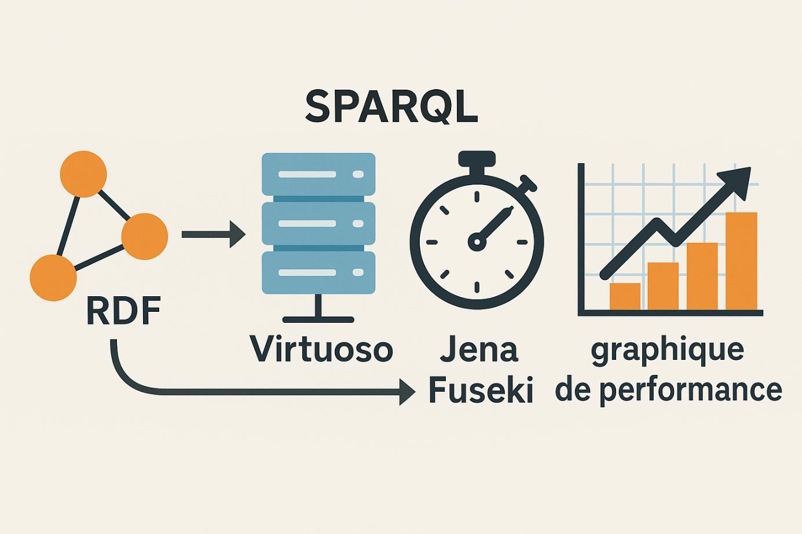
1. Définition du cadre d'évaluation
La définition d'un cadre d'évaluation rigoureux constitue la pierre angulaire de notre démarche comparative. Cette étape préliminaire détermine la validité et la portée de nos résultats expérimentaux. Il s'agit de préciser les objectifs poursuivis, d'identifier les métriques pertinentes et de caractériser l'environnement technique dans lequel se dérouleront les expérimentations.
Cette approche méthodologique s'inspire des meilleures pratiques établies dans le domaine de l'évaluation des systèmes de gestion de bases de données, tout en tenant compte des spécificités du modèle RDF et des requêtes SPARQL. La rigueur de cette définition préalable conditionne directement la qualité et la reproductibilité de nos résultats.
1.1. Objectifs de l'évaluation
Notre évaluation s'articule autour de cinq objectifs principaux qui guident l'ensemble de notre démarche expérimentale. Ces objectifs ont été définis en tenant compte des besoins exprimés par la communauté du Web sémantique et des lacunes identifiées dans la littérature existante.
**Figure 2 : Objectifs de l'évaluation**

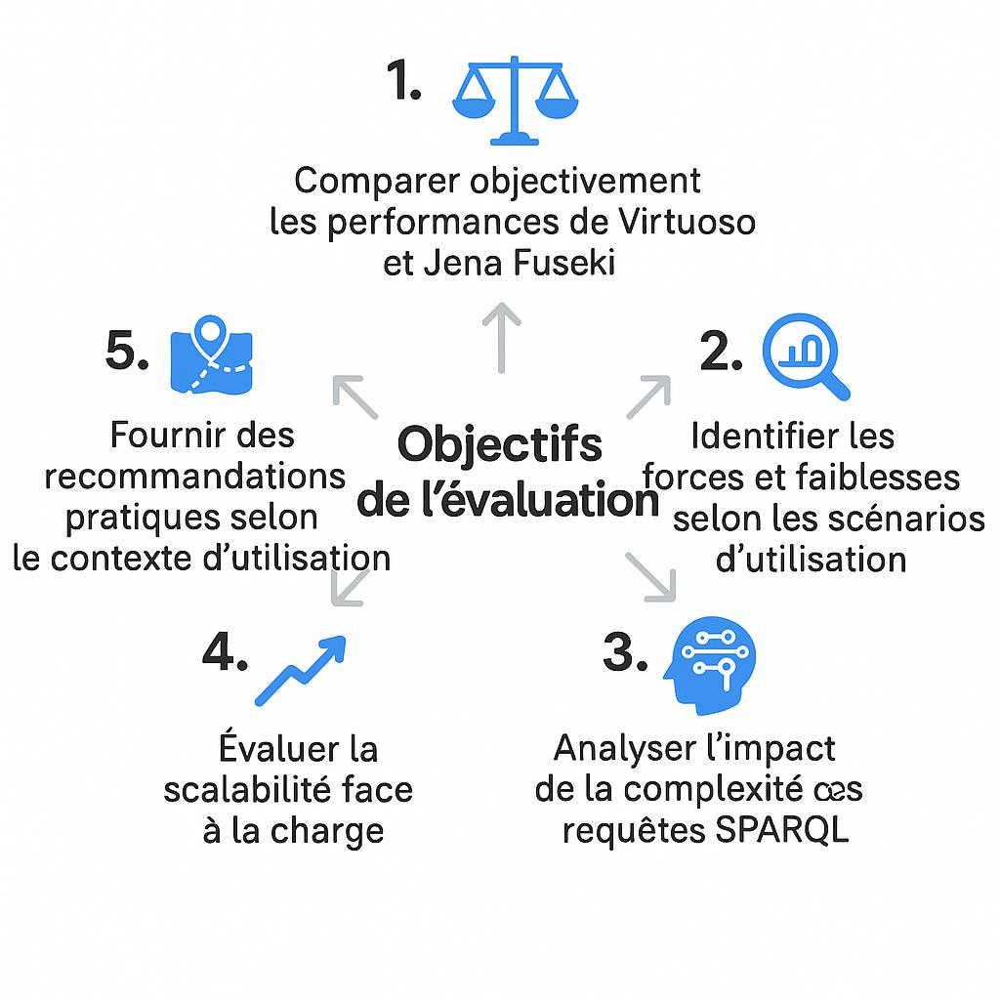
Premier objectif : Comparer objectivement les performances
Notre premier objectif consiste à comparer Virtuoso et Jena Fuseki dans des conditions d'utilisation contrôlées et reproductibles. Cette comparaison dépasse la simple mesure des temps d'exécution.
Elle s'étend à l'analyse de l'utilisation des ressources système et de la fiabilité des moteurs. L'objectivité de cette comparaison repose sur l'utilisation de métriques standardisées et d'un protocole expérimental rigoureux qui élimine les biais potentiels.
Deuxième objectif : Identifier les forces et faiblesses spécifiques
Le deuxième objectif vise à identifier les forces et faiblesses spécifiques de chaque moteur selon différents scénarios d'utilisation. Cette analyse différentielle permet de comprendre dans quelles conditions chaque moteur excelle ou montre ses limites.
Elle s'appuie sur une typologie fine des requêtes SPARQL et une analyse multidimensionnelle des performances. Cette approche prend en compte la complexité algorithmique, la structure des données et les stratégies d'optimisation déployées.
Troisième objectif : Analyser l'impact de la complexité des requêtes
Notre troisième objectif consiste à analyser l'impact de la complexité des requêtes sur les performances des deux moteurs. Cette analyse permet d'établir des profils de performance selon la complexité croissante des requêtes.
Elle couvre la progression depuis les patterns de base jusqu'aux requêtes impliquant des jointures multiples et des opérateurs avancés. Cette dimension est particulièrement importante pour les développeurs d'applications qui doivent anticiper les performances selon la nature de leurs requêtes.
Quatrième objectif : Évaluer la scalabilité
Le quatrième objectif porte sur l'évaluation de la scalabilité des moteurs face à l'augmentation de la charge de travail. Cette évaluation comprend l'analyse du comportement face à plusieurs facteurs :
L'augmentation du volume de données
La complexité croissante des requêtes
Le nombre de requêtes simultanées
Cette dimension est cruciale pour les déploiements en production où les conditions de charge peuvent varier significativement.
Cinquième objectif : Fournir des recommandations pratiques
Enfin, notre cinquième objectif consiste à fournir des recommandations pratiques pour le choix d'un moteur selon le contexte d'utilisation. Ces recommandations s'appuient sur l'ensemble des résultats expérimentaux et visent à guider les praticiens dans leurs décisions architecturales.
Elles prennent en compte plusieurs aspects :
Les performances brutes mesurées
La facilité de déploiement
La stabilité du système
La richesse des fonctionnalités
### 1.2. Métriques de performance retenues

Notre plateforme v2.0 collecte **5 catégories principales de métriques** qui couvrent tous les aspects des performances des moteurs SPARQL :

**Figure 3 : Métriques de performance (plateforme v2.0)**

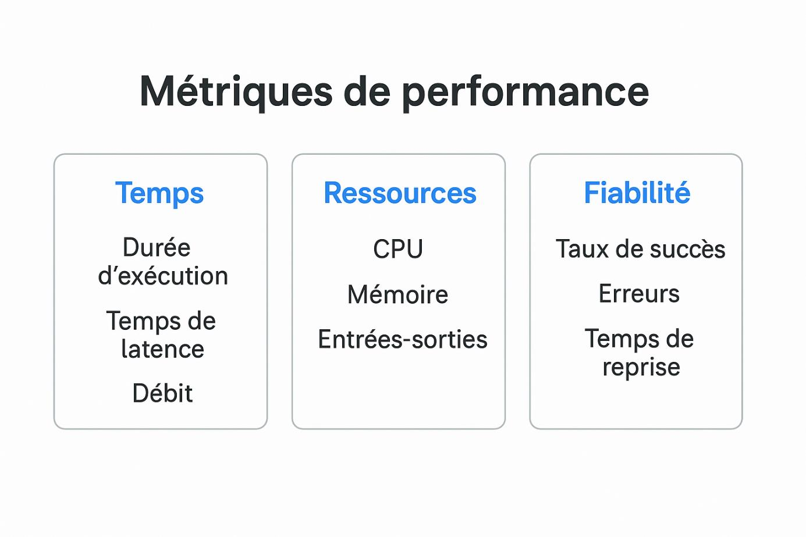

#### 1.2.1. Métriques temporelles de base

**Temps d'exécution** : Durée totale (parsing → résultats)
- Mesure : `time.perf_counter()` Python (précision sub-milliseconde)
- Phases incluses : Analyse syntaxique, optimisation, exécution, formatage
- Indicateur principal : Expérience utilisateur directe

**Temps de première réponse** : Latence jusqu'au premier résultat
- Pertinence : Requêtes à nombreux résultats
- Révèle : Stratégies de streaming vs matérialisation

**Débit** : Capacité de traitement (QPS - Queries Per Second)
- Calcul : Nombre de requêtes réussies / durée totale session
- Utilité : Dimensionnement infrastructures production

#### 1.2.2. Métriques de ressources système

**Utilisation CPU** : Pourcentage d'utilisation processeur
- Collecte : Bibliothèque `psutil` avec échantillonnage adaptatif
- Interprétation : Charge computationnelle vs inefficacités algorithmiques

**Consommation mémoire** : RAM utilisée (Mo)
- Composantes : Données, index, plans d'exécution, résultats intermédiaires
- Impact : Scalabilité et aptitude environnements à ressources limitées

**Opérations I/O** : Activité lecture/écriture (optionnel)
- Révèle : Stratégies de cache et organisation physique des données

#### 1.2.3. Métriques de fiabilité

**Taux de succès** : Pourcentage de requêtes sans erreur
- Calcul : (Requêtes réussies / Total requêtes) × 100
- Seuil attendu : >95% pour production

**Stabilité** : Variance et coefficient de variation
- Mesures : Écart-type, CV des temps d'exécution
- Indicateur : Prévisibilité et cohérence du comportement

**Gestion d'erreurs** : Classification des échecs
- Types : Syntaxe, timeouts, connectivité, mémoire
- Analyse : Identification des faiblesses spécifiques

#### 1.2.4. Métriques avancées (Plateforme v2.0)

**Percentile 95 (P95)** : Temps sous lequel 95% des requêtes s'exécutent
- Utilité : Garanties de performance pour SLA
- Robustesse : Insensible aux valeurs extrêmes (outliers)

**Intervalle interquartile (IQR)** : Dispersion robuste
- Calcul : Q3 - Q1
- Avantage : Non affecté par les valeurs aberrantes

**Success rate par type de requête** : Fiabilité différentielle
- Révèle : Types de requêtes problématiques pour chaque moteur

#### 1.2.5. Métriques de chunking (Innovation v2.0)

**Taux de chunking** : Pourcentage de requêtes découpées
- Calcul : (Requêtes chunkées / Total) × 100
- Révèle : Efficacité du système de découpage automatique

**Overhead du chunking** : Surcoût du découpage
- Mesure : Temps chunking vs exécution directe
- Optimisation : <10% pour être considéré acceptable

**Nombre moyen de chunks** : Granularité du découpage
- Dépend de : Complexité requête et taille résultats attendus
- Guidé par : Analyse syntaxique AST (Abstract Syntax Tree)
1.3. Environnement technique d'évaluation
Cette section détaille l'environnement technique utilisé pour les expérimentations : configuration matérielle, logiciels et paramètres des moteurs SPARQL. 
1.3.1. Configuration matérielle
La configuration matérielle standardisée garantit des conditions d'exécution reproductibles et évite les goulots d'étranglement qui pourraient biaiser les résultats.
**Figure 4 : Configuration matérielle**

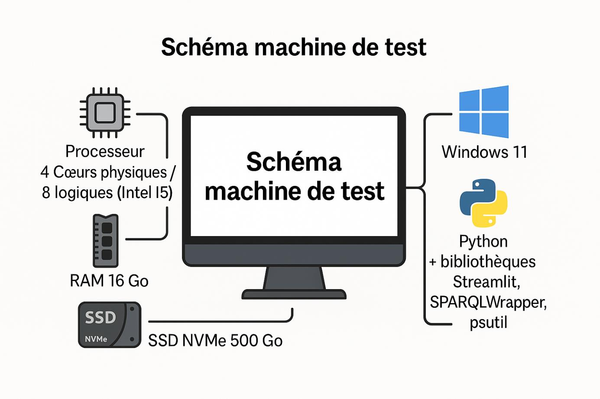
Processeur : Intel Core i5-1135G7 @ 2.42 GHz (4 cœurs physiques, 8 threads logiques)
Mémoire RAM : 16 Go DDR4-3200 
Stockage: SSD NVMe 500 Go (3500/3000 MB/s lecture/écriture).
Configuration Réseau : Connexions locales (localhost) 
1.3.2. Configuration logicielle
L'environnement logiciel est configuré pour assurer stabilité et reproductibilité :
Système et runtime :
OS : Windows 11 Professionnel 21H2
Python : 3.10.2 avec bibliothèques optimisées
Reproduction Linux : Prévue en perspective pour validation croisée
Dépendances principales :
**Tableau 1 : Dépendances principales**

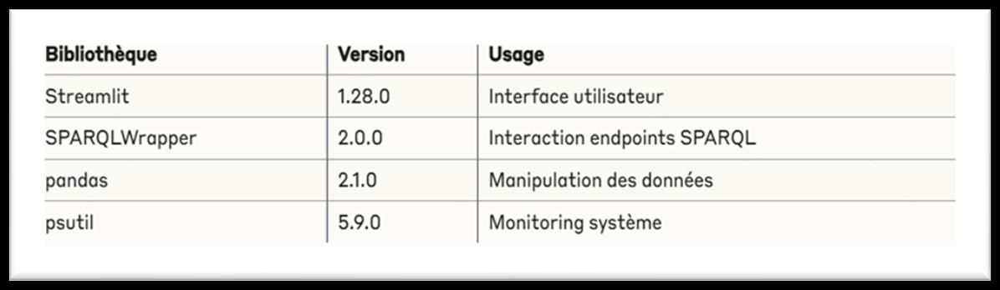
1.3.3. Paramètres de configuration des moteurs
Les paramètres des moteurs SPARQL ont été optimisés pour assurer des comparaisons équitables tout en conservant leurs caractéristiques distinctives.
Configuration Virtuoso :
Les paramètres de configuration de Virtuoso ont été optimisés pour notre environnement de test tout en conservant des valeurs réalistes pour un déploiement en production. Le fichier de configuration virtuoso.ini spécifie une allocation de NumberOfBuffers = 680000 et MaxDirtyBuffers = 500000, ce qui correspond à environ 5 Go de cache en mémoire. Cette configuration permet d'exploiter efficacement la RAM disponible tout en maintenant des performances cohérentes.
Les paramètres de logging ont été ajustés pour minimiser l'impact sur les performances tout en conservant les informations essentielles pour le débogage. Le paramètre CheckpointSyncMode = 0 désactive la synchronisation forcée des checkpoints pour optimiser les performances d'écriture, tandis que NumberOfBuffers et MaxDirtyBuffers sont dimensionnés pour exploiter efficacement la mémoire disponible.
Configuration Jena Fuseki :
La configuration de Jena Fuseki repose sur des paramètres JVM optimisés et une configuration TDB adaptée à nos jeux de données. Les paramètres JVM incluent -Xmx8g pour allouer 8 Go de mémoire maximale à la JVM et -Xms2g pour une allocation initiale de 2 Go. Ces valeurs assurent une montée en charge progressive tout en évitant les garbage collections excessives qui pourraient impacter les mesures.
Les optimisations TDB incluent l'activation du cache des nœuds et l'utilisation d'index optimisés pour les patterns de requêtes les plus fréquents. Le paramètre tdb:unionDefaultGraph true est activé pour améliorer les performances sur les requêtes multi-graphes, tandis que les statistiques sont régulièrement mises à jour pour optimiser les plans d'exécution.
2. Conception des jeux de données
La sélection et la caractérisation des jeux de données constituent un élément déterminant de la validité de notre évaluation comparative. Les données utilisées doivent refléter la diversité des applications du Web sémantique tout en permettant un contrôle précis des variables expérimentales. Cette section présente notre approche méthodologique pour la conception d'un ensemble représentatif de jeux de données qui couvrent différents domaines d'application, volumes et structures.
Notre stratégie de sélection privilégie un équilibre entre la représentativité des cas d'usage réels et la nécessité de contrôler les paramètres expérimentaux. Cette approche nous permet d'analyser les performances des moteurs dans des conditions variées tout en maintenant la rigueur scientifique nécessaire à l'interprétation des résultats.
2.1. Sélection des datasets
Le processus de sélection des jeux de données s'appuie sur une analyse systématique des besoins d'évaluation et des caractéristiques des applications du Web sémantique. Cette sélection vise à couvrir un spectre large de cas d'usage tout en respectant les contraintes pratiques liées à la disponibilité et à la qualité des données.
2.1.1. Critères de sélection
Notre processus de sélection repose sur quatre critères principaux qui garantissent la pertinence et la qualité des jeux de données retenus pour l'évaluation.
Diversité structurelle :
Variations dans la densité du graphe RDF 
Profondeur des hiérarchies de classes 
Fréquence d'utilisation des propriétés 
Complexité des schémas ontologiques
Volumes variés :
Couverture de différents ordres de grandeur (milliers à millions de triplets) 
Analyse de la scalabilité des moteurs 
Identification des seuils critiques de performance
Diversité des domaines d'application : 
Enseignement supérieur, encyclopédie collaborative, commerce électronique 
Généralisation à un large éventail d'applications pratiques 
Identification des spécialisations potentielles des moteurs
Disponibilité et reproductibilité :
Accessibilité publique des données 
Documentation complète et métadonnées suffisantes 
Validation indépendante des résultats
#### 2.1.2. Datasets retenus (Plateforme v2.0)

Notre plateforme v2.0 supporte **3 catégories principales** avec synchronisation automatique garantie entre Virtuoso et Fuseki.

**Figure 5 : Datasets principal retenus**

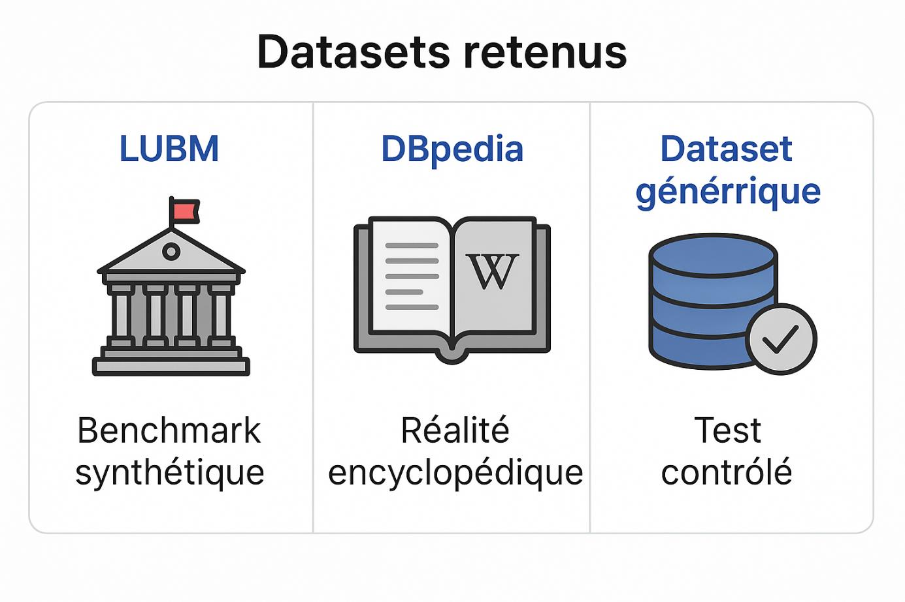

**LUBM (Lehigh University Benchmark)** :

*Caractéristiques* :
- Volume : 100,000 triplets RDF (configuration standard)
- Ontologie : OWL universitaire (étudiants, professeurs, cours, départements)
- Générateur : LUBM officiel avec paramètres reproductibles
- Catalogue : **18 requêtes SPARQL** classées en 6 types de complexité

*Synchronisation v2.0* :
- Métriques vérifiées : Triplets totaux, sujets uniques, prédicats uniques, classes
- Tolérance : <5% de divergence
- Validation : 12 contrôles automatiques réussis pendant expérimentations
- Résultat : **100% de cohérence** Virtuoso ↔ Fuseki

Le benchmark LUBM occupe une place centrale dans notre évaluation en raison de ses caractéristiques techniques particulièrement adaptées à l'analyse comparative. Ce jeu de données synthétique modélise le domaine universitaire avec une ontologie OWL bien structurée qui inclut des hiérarchies de classes complexes et des propriétés aux sémantiques riches. La structure hiérarchique bien définie et la présence de propriétés inverses font de LUBM un excellent test pour les capacités de raisonnement et d'optimisation des moteurs SPARQL.

**DBpedia** :

*Caractéristiques* :
- Volume : 2.5 millions de triplets (extraction ciblée)
- Domaine : Données encyclopédiques multilingues
- Prefixes : dbo (ontologie), dbp (propriétés), dbr (ressources)
- Catalogue : **18 requêtes SPARQL** sur personnes, films, villes, pays

*Synchronisation v2.0* :
- Format détecté : Automatique via analyse des prefixes
- Export : SPARQL CONSTRUCT avec chunking (100K triplets/batch)
- Durée synchronisation : ~8 minutes pour 2.5M triplets
- Validation : Comparaison sémantique post-import

DBpedia apporte la dimension des données réelles à notre évaluation en fournissant un accès structuré à l'information encyclopédique de Wikipédia. Les caractéristiques distinctives de DBpedia incluent des données encyclopédiques multilingues avec une couverture thématique exceptionnellement large. Cette interconnexion dense crée des opportunités de jointures complexes qui testent efficacement les algorithmes d'optimisation des moteurs.

**Dataset générique** :

*Caractéristiques* :
- Volume : Configurable (10K à 1M triplets)
- Ontologies : RDF, RDFS, OWL standards
- Patterns : Triple patterns universels
- Catalogue : **18 requêtes SPARQL** compatibles tout dataset RDF

*Synchronisation v2.0* :
- Avantage : Contrôle total sur structure et volume
- Utilité : Tests ciblés et validation plateforme
- Génération : Script automatisé avec paramètres ajustables

Pour compléter notre panoplie d'évaluation, nous avons développé un dataset générique entièrement paramétrable qui permet de tester des scenarios spécifiques et de contrôler précisément les variables expérimentales. Cette flexibilité permet de créer des jeux de données sur mesure pour tester des hypothèses particulières ou pour isoler l'impact de certains paramètres sur les performances.
2.2. Caractéristiques des datasets
L'analyse approfondie des caractéristiques structurelles et statistiques des jeux de données constitue un prérequis essentiel à l'interprétation correcte des résultats de performance. Cette analyse nous permet de comprendre les défis spécifiques posés par chaque dataset et d'identifier les facteurs qui influencent les performances des moteurs SPARQL.
2.2.1. Analyse structurelle
L'analyse structurelle révèle les propriétés intrinsèques des graphes RDF qui déterminent la complexité computationnelle des requêtes SPARQL.
Distribution des prédicats : Elle constitue un indicateur clé de l'hétérogénéité des données. Une distribution uniforme indique un usage équilibré des propriétés. Une distribution biaisée révèle des propriétés dominantes qui peuvent bénéficier d'optimisations spécialisées.
Analyse incluse :
Fréquence d'usage de chaque prédicat
Identification des propriétés les plus sélectives
Évaluation de l'entropie pour quantifier l'hétérogénéité
Connectivité du graphe : Elle caractérise la densité des interconnexions entre entités RDF. Cette densité influence directement la complexité des jointures SPARQL.
Le degré moyen des nœuds fournit une mesure globale de connectivité. Les distributions des degrés révèlent la présence de nœuds fortement connectés qui peuvent constituer des points chauds.
Profondeur des chemins :
Évalue la longueur maximale et moyenne des chaînes de propriétés
Importante pour les requêtes avec property paths
Révèle les structures hiérarchiques complexes nécessitant des optimisations spécialisées
Clustering naturel :
Identifie les regroupements thématiques ou structurels
Exploitable pour l'optimisation des requêtes et l'organisation physique
Guide les stratégies de partitionnement des données
2.2.2. Métriques de complexité
Les métriques de complexité quantifient les défis computationnels posés par les jeux de données et permettent de prédire les performances relatives des moteurs selon les caractéristiques des données.
La sélectivité des prédicats mesure la capacité de chaque propriété à discriminer les entités dans le graphe RDF. Cette métrique est calculée comme le rapport entre le nombre de sujets uniques et le nombre total d'instances pour chaque prédicat. Une sélectivité élevée indique qu'un prédicat permet de réduire efficacement l'espace de recherche, tandis qu'une sélectivité faible suggère que le prédicat est peu discriminant. L'analyse de la sélectivité guide les stratégies d'ordonnancement des triples patterns dans les requêtes SPARQL et influence le choix des index à créer.
La cardinalité des jointures évalue le nombre de résultats produits par les opérations de jointure entre différents patterns RDF. Cette métrique est cruciale pour l'estimation des coûts et l'optimisation des plans d'exécution. L'analyse inclut le calcul de la cardinalité moyenne et de la variance pour différents types de jointures (star, chain, cycle), l'identification des jointures les plus coûteuses, et l'évaluation de l'impact de l'ordre des jointures sur la performance globale.
La variabilité des types de données quantifie la diversité des types de littéraux présents dans le dataset et leur impact sur les performances des opérations de filtrage et de comparaison. Cette analyse inclut l'inventaire des types XSD utilisés, l'évaluation de la fréquence de chaque type, et l'analyse de la complexité des opérations de conversion et de comparaison. La présence de types complexes comme les dates, les nombres décimaux ou les chaînes multilingues peut influencer significativement les performances des requêtes impliquant des filtres ou des opérations d'agrégation.
3. Conception des requêtes de test
La conception d'un catalogue complet et représentatif de requêtes de test constitue un élément central de notre méthodologie d'évaluation. Ces requêtes doivent couvrir l'ensemble des fonctionnalités SPARQL tout en reflétant les patterns d'utilisation réels 
du Web sémantique. Notre approche systématique vise à créer un ensemble de requêtes qui permet une évaluation exhaustive et équitable des capacités des moteurs testés.
Cette section présente notre taxonomie des requêtes SPARQL et détaille la construction méthodologique de notre catalogue de tests. L'objectif est de fournir une couverture exhaustive des patterns SPARQL tout en maintenant une progression logique de la complexité qui permet d'analyser finement les performances des moteurs selon différents niveaux de difficulté.
### 3.1. Typologie des requêtes SPARQL (Plateforme v2.0)

Notre classification couvre **6 catégories principales** avec **60+ requêtes** réparties équitablement entre LUBM (18), DBpedia (18), et génériques (18).

**Figure 6 : Typologie des requêtes SPARQL v2.0**

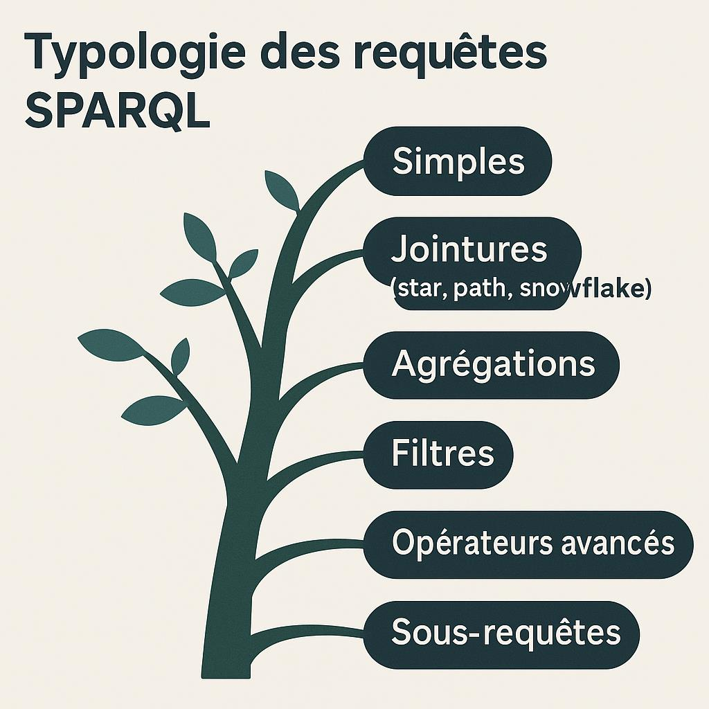

| Catégorie | Complexité | Opérations principales | Nb requêtes | Défis d'optimisation |
|-----------|------------|------------------------|-------------|----------------------|
| **1. Basic SELECT** | Faible | Pattern matching simple | 10 | Indexation, cache |
| **2. JOIN** | Moyenne | Jointures (star, path, snowflake) | 12 | Ordre jointures, cardinalité |
| **3. FILTER** | Moyenne | Conditions, expressions | 10 | Placement filtres, sélectivité |
| **4. OPTIONAL/UNION** | Élevée | Jointures externes, unions | 10 | Gestion NULL, déduplication |
| **5. Aggregation** | Élevée | GROUP BY, COUNT, SUM, AVG | 10 | Tri, groupement, mémoire |
| **6. Subquery** | Très élevée | Requêtes imbriquées, EXISTS | 8 | Décorrélation, matérialisation |

**Total** : **60 requêtes** réparties sur 3 datasets

**Classification par dataset** :

**LUBM (18 requêtes)** :
- Basic SELECT (3) : Étudiants, professeurs, cours
- JOIN (4) : Relations académiques, hiérarchies
- FILTER (3) : Propriétés numériques, textuelles
- OPTIONAL/UNION (3) : Informations partielles
- Aggregation (3) : Statistiques départementales
- Subquery (2) : Analyses complexes

**DBpedia (18 requêtes)** :
- Basic SELECT (3) : Personnes, lieux, films
- JOIN (4) : Relations encyclopédiques
- FILTER (3) : Dates, langues, catégories
- OPTIONAL/UNION (3) : Données multilingues
- Aggregation (3) : Comptages thématiques
- Subquery (2) : Requêtes analytiques

**Dataset générique (18 requêtes)** :
- Basic SELECT (4) : Patterns universels
- JOIN (4) : Topologies variées
- FILTER (4) : Expressions diverses
- OPTIONAL/UNION (4) : Opérateurs ensemblistes
- Aggregation (4) : Fonctions d'agrégation
- Subquery (4) : Imbrications complexes

Cette approche classificatoire présente l'avantage de permettre une analyse différentielle des performances selon le type de requête, révélant ainsi les forces et faiblesses spécifiques de chaque moteur. Elle facilite également l'interprétation des résultats en établissant une correspondance claire entre les patterns de requêtes et les défis algorithmiques qu'ils représentent.
3.1.1. Requêtes simples (Basic Pattern Matching)
Les requêtes simples constituent la catégorie fondamentale de notre taxonomie et servent de référence pour l'évaluation des performances de base des moteurs SPARQL. Ces requêtes impliquent uniquement des opérations de pattern matching direct sans jointures complexes ni opérateurs avancés.
Cette catégorie teste principalement l'efficacité des structures d'indexation et des algorithmes de recherche de base. Les performances sur ces requêtes révèlent la qualité de l'implémentation des opérations fondamentales et constituent un indicateur de la réactivité générale du système.
**Figure 7 : Recherche par type d'entité**

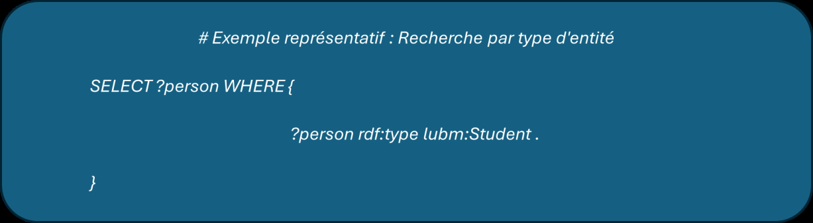
Cette requête exemplifie le pattern le plus basique de SPARQL : la recherche d'entités appartenant à une classe spécifique. L'exécution de cette requête sollicite principalement l'index par prédicat et objet (POX), testant ainsi l'efficacité de la résolution des types RDF. La performance sur ce type de requête dépend largement de la qualité des statistiques maintenues sur les classes et de l'efficacité des algorithmes de parcours d'index.
Les variantes de cette catégorie incluent la recherche par propriété spécifique, la récupération de littéraux selon leur type, et les patterns impliquant des variables dans différentes positions du triplet RDF. Ces variations permettent de tester systématiquement l'efficacité des différents index SPO, PSO, et OSP maintenues par les moteurs.
3.1.2. Requêtes de jointure
Les requêtes de jointure représentent une montée en complexité significative et constituent souvent le facteur déterminant des performances globales des moteurs SPARQL. Cette catégorie se subdivise en plusieurs sous-types selon la topologie des jointures impliquées.
Star queries :
Les star queries constituent un pattern particulièrement fréquent dans les applications réelles du Web sémantique. Elles impliquent un sujet central connecté à plusieurs objets par différentes propriétés, créant une structure en étoile dans le graphe de requête.
**Figure 8 : Profil complet d'étudiant**

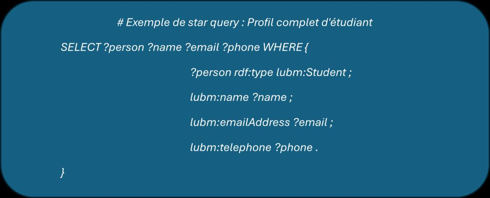
Cette requête illustre un cas d'usage typique où l'on souhaite récupérer l'ensemble des informations disponibles sur une entité spécifique. L'exécution efficace de ce pattern nécessite des stratégies d'optimisation sophistiquées pour minimiser les accès aux index et exploiter la localité des données. Les moteurs peuvent appliquer différentes stratégies : démarrage par le pattern le plus sélectif, utilisation de hash joins, ou exploitation d'index spécialisés pour les star queries.
Path queries :
Les path queries impliquent la traversée de chemins dans le graphe RDF, connectant des entités distantes par une séquence de propriétés. Ce pattern teste la capacité des moteurs à optimiser les jointures en chaîne et à gérer efficacement les résultats intermédiaires.
**Figure 9 : Relation étudiant-conseiller-département**

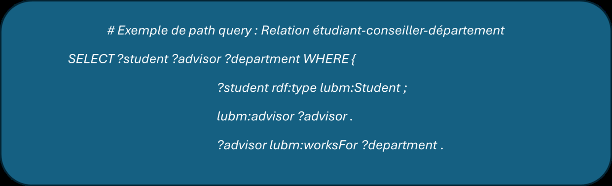
Cette requête nécessite deux jointures successives qui peuvent générer des résultats intermédiaires volumineux si les stratégies d'optimisation ne sont pas appropriées. L'ordre d'exécution des jointures devient critique : commencer par la jointure la plus sélective peut réduire dramatiquement la complexité computationnelle. Les moteurs avancés peuvent détecter et exploiter les property paths pour optimiser ce type de requête.
Snowflake queries :
Les snowflake queries combinent plusieurs branches d'étoiles connectées, créant des topologies complexes qui challengent les algorithmes d'optimisation. Ces requêtes sont représentatives des besoins d'analyse complexe dans les applications d'intelligence d'affaires sur données sémantiques.
3.1.3. Requêtes d'agrégation
Les requêtes d'agrégation introduisent des opérations de groupement et de calcul qui testent les capacités analytiques des moteurs SPARQL. Cette catégorie évalue l'efficacité des algorithmes de tri, de groupement et de calcul d'agrégats.
**Figure 10 : Comptage d'étudiants par département**

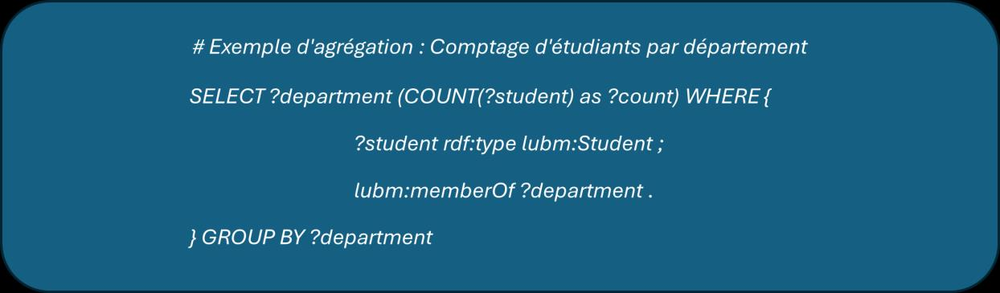
Cette requête combine plusieurs défis algorithmiques : jointure entre étudiants et départements, groupement par département, comptage des occurrences, et tri des résultats. L'exécution efficace nécessite des stratégies d'optimisation spécialisées comme l'utilisation de hash tables pour le groupement, l'implémentation d'algorithmes de tri externes pour les gros volumes, et l'exploitation de statistiques précalculées quand elles sont disponibles.
Les variations incluent d'autres fonctions d'agrégation (SUM, AVG, MIN, MAX), les agrégations multi-niveaux avec plusieurs clauses GROUP BY, et les agrégations conditionnelles utilisant HAVING. Ces patterns permettent d'évaluer la richesse fonctionnelle et l'efficacité des implémentations des opérateurs analytiques.
3.1.4. Requêtes avec filtres et expressions
Les requêtes avec filtres testent l'efficacité des mécanismes d'évaluation d'expressions et de filtrage des résultats. Cette catégorie révèle la capacité des moteurs à optimiser le placement des filtres et à évaluer efficacement les expressions complexes.
**Figure 11 : Filtres multiples et expressions**

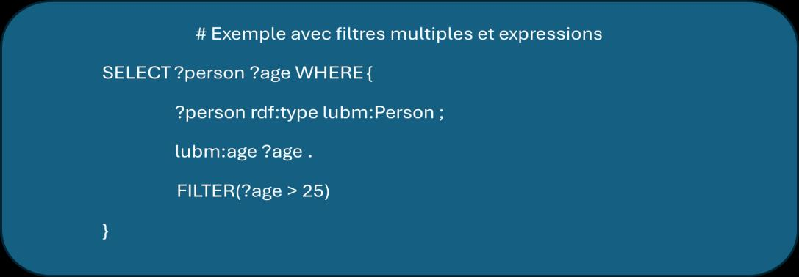
Cette requête illustre l'utilisation de filtres numériques et textuels combinés. L'optimisation de telles requêtes implique des décisions critiques sur le placement des filtres : les appliquer tôt peut réduire les résultats intermédiaires, mais peut aussi nécessiter des évaluations coûteuses. Les moteurs sophistiqués estiment le coût et la sélectivité de chaque filtre pour déterminer l'ordre d'évaluation optimal.
Les expressions SPARQL incluent les opérateurs arithmétiques, logiques, de comparaison, ainsi que les fonctions intégrées pour la manipulation de chaînes, dates, et URIs. L'évaluation de ces expressions peut être optimisée par la compilation vers du code natif, l'utilisation de caches pour les sous-expressions communes, et l'exploitation de l'indexation pour les filtres fréquents.
3.1.5. Requêtes avec OPTIONAL, UNION et MINUS
Cette catégorie teste l'implémentation des opérateurs ensemblistes avancés de SPARQL qui modifient la sémantique des jointures et introduisent des complexités algorithmiques spécifiques.
Opérateur OPTIONAL :
Figure 12 : Informations complètes avec données optionnelles
L'opérateur OPTIONAL implémente une jointure externe gauche qui conserve tous les résultats de la partie obligatoire même si les parties optionnelles ne produisent pas de résultats. Cette sémantique nécessite des algorithmes spécialisés comme les hash joins externes ou les nested loop joins avec gestion des valeurs nulles. L'optimisation de ces requêtes implique des décisions sur l'ordre d'évaluation des parties optionnelles et la gestion efficace des résultats partiels.
Opérateur UNION :
Voici ci-dessous un exemple de requête avec l’opérateur UNION : Recherche dans plusieurs classes
Figure 13 : Recherche dans plusieurs classes
L'opérateur UNION implémente l'union de deux sous-requêtes, nécessitant des algorithmes pour combiner les résultats tout en éliminant les doublons potentiels. L'optimisation peut inclure l'exécution parallèle des branches de l'union, l'utilisation de hash sets pour la déduplication, et la propagation des contraintes communes aux différentes branches.
Opérateur MINUS :
L'opérateur MINUS implémente la différence ensembliste, excluant les résultats qui satisfont une condition supplémentaire. Cet opérateur est particulièrement coûteux car il nécessite souvent la matérialisation complète des résultats intermédiaires pour effectuer la soustraction.
3.1.6. Sous-requêtes complexes
Les sous-requêtes représentent le niveau de complexité le plus élevé de notre taxonomie, combinant plusieurs des patterns précédents dans des structures hiérarchiques qui testent les limites des optimiseurs de requêtes.
Figure 14 : Exemple de sous-requête avec EXISTS
Cette requête illustre l'utilisation du pattern EXISTS avec une sous-requête d'agrégation pour identifier les départements ayant plus de 10 étudiants. L'optimisation de telles requêtes nécessite des techniques avancées comme la décorrélation des sous-requêtes, la transformation en jointures semi-externes, et l'exploitation de vues matérialisées pour les sous-requêtes fréquentes.
Les sous-requêtes peuvent également apparaître dans les clauses SELECT (sous-requêtes scalaires), FROM (vues dérivées), et dans les expressions complexes. Chaque contexte présente des défis d'optimisation spécifiques et teste différents aspects des moteurs SPARQL.
3.2. Construction du catalogue de requêtes représentatives
La construction de notre catalogue de requêtes suit une méthodologie rigoureuse qui combine la sélection de requêtes standards issues des benchmarks établis avec le développement de requêtes synthétiques spécialement conçues pour tester des aspects spécifiques des moteurs SPARQL. Cette approche hybride assure à la fois la comparabilité avec les études existantes et la capacité à explorer des dimensions inédites de la performance.
3.2.1. Méthode de sélection et développement
Notre processus de construction du catalogue s'appuie sur trois sources principales qui garantissent la représentativité et la complétude de notre ensemble de tests.
Requêtes standards des benchmarks :
Nous avons sélectionné un ensemble représentatif de requêtes issues des benchmarks les plus reconnus dans la communauté du Web sémantique. Cette sélection inclut les 14 requêtes standards du benchmark LUBM qui couvrent différents patterns de complexité croissante. Ces requêtes ont l'avantage d'être largement étudiées dans la littérature, ce qui facilite la comparaison de nos résultats avec les études antérieures.
Les requêtes BSBM (Berlin SPARQL Benchmark) apportent une perspective orientée commerce électronique avec des patterns représentatifs des applications web modernes. Ces requêtes incluent des recherches de produits, des analyses de tendances, et des requêtes d'aide à la décision qui testent différents aspects des moteurs SPARQL.
Les requêtes SP²Bench complète cette sélection avec des patterns spécialement conçus pour révéler les points faibles des implémentations SPARQL. Ces requêtes incluent des cas pathologiques qui peuvent provoquer des dégradations de performance importantes et révéler les limites des algorithmes d'optimisation.
Requêtes synthétiques spécialisées :
Pour compléter les requêtes standards, nous avons développé un ensemble de requêtes synthétiques spécialement conçues pour tester des aspects spécifiques des moteurs SPARQL. Ces requêtes permettent d'isoler l'impact de certains facteurs sur les performances et de valider des hypothèses spécifiques sur le comportement des moteurs.
Les requêtes de stress test sont conçues pour pousser les moteurs dans leurs limites en utilisant des patterns particulièrement coûteux comme les produits cartésiens, les jointures cycliques, et les agrégations sur de gros volumes. Ces requêtes révèlent les stratégies de gestion des ressources et les mécanismes de protection contre les requêtes pathologiques.
Les requêtes de micro-benchmarks testent des fonctionnalités spécifiques isolément, permettant une analyse fine des performances sur des opérations particulières comme l'évaluation de fonctions SPARQL, la gestion des types de données, ou l'optimisation des property paths.
Gradation méthodique de la complexité :
Notre catalogue organise les requêtes selon une progression logique de complexité qui permet d'analyser l'évolution des performances selon la difficulté algorithmique. Cette gradation commence par les patterns les plus simples et introduit progressivement des éléments de complexité supplémentaires.
La progression suit généralement cette séquence : 
Requêtes de base → jointures simples → jointures multiples → agrégations → filtres complexes → opérateurs ensemblistes → sous-requêtes. 
Cette organisation permet d'identifier précisément les seuils de complexité où les performances de chaque moteur commencent à se dégrader et de comprendre les causes de ces dégradations.
3.2.2. Paramétrage et variations des requêtes
Le paramétrage de nos requêtes permet d'adapter leur complexité et leur sélectivité selon les besoins spécifiques de chaque test. Cette flexibilité est essentielle pour analyser finement l'impact de différents facteurs sur les performances.
Contrôle de la taille des résultats :
L'utilisation de clauses LIMIT variables permet de contrôler la taille des ensembles de résultats et d'analyser l'impact de ce facteur sur les performances. Des limites faibles (LIMIT 10) testent la capacité des moteurs à produire rapidement les premiers résultats, tandis que des limites élevées ou l'absence de limite testent la capacité à traiter de gros volumes de données.
Ce paramétrage révèle également l'efficacité des stratégies de streaming et de pagination implémentées par les moteurs. Certains moteurs peuvent optimiser spécifiquement les requêtes avec LIMIT en arrêtant l'exécution dès que le nombre requis de résultats est atteint, tandis que d'autres matérialisent l'ensemble complet avant d'appliquer la limitation.
Variation de la sélectivité :
La modification des contraintes et filtres permet de faire varier la sélectivité des requêtes et d'analyser l'impact de ce facteur sur les performances. Des filtres très sélectifs réduisent drastiquement l'espace de recherche et favorisent certaines stratégies d'optimisation, tandis que des filtres peu sélectifs nécessitent le traitement de volumes importants de données intermédiaires.
Cette variation de sélectivité permet également de tester la qualité des estimations de cardinalité utilisées par les optimiseurs de requêtes. Des estimations incorrectes peuvent conduire à des choix de plans d'exécution sous-optimaux qui se révèlent coûteux à l'exécution.
Combinaisons d'opérateurs :
Le paramétrage inclut également la création de variations combinant différents opérateurs SPARQL pour tester l'interaction entre les différents mécanismes d'optimisation. Ces combinaisons révèlent les synergies ou les conflits potentiels entre les différentes stratégies d'optimisation.
Par exemple, la combinaison de jointures complexes avec des opérateurs OPTIONAL peut révéler des inefficacités dans la gestion des jointures externes, tandis que l'association d'agrégations avec des filtres peut tester l'efficacité des optimisations de pushdown des prédicats.
4. Protocole expérimental
L'établissement d'un protocole expérimental rigoureux constitue le garant de la validité scientifique de notre évaluation comparative. Ce protocole doit assurer la reproductibilité des résultats, minimiser les biais expérimentaux, et permettre une collecte exhaustive et fiable des métriques de performance. Cette section détaille l'architecture de notre plateforme de test, les procédures d'exécution standardisées, et les méthodes statistiques employées pour analyser les résultats.
Notre approche protocolaire s'inspire des meilleures pratiques établies dans le domaine de l'évaluation des systèmes de gestion de bases de données, tout en tenant compte des spécificités du modèle RDF et des requêtes SPARQL. L'automatisation complète du processus d'évaluation garantit la cohérence des conditions expérimentales et élimine les sources potentielles d'erreur humaine.
4.1. Architecture de la plateforme de test
Notre plateforme d'évaluation repose sur une architecture modulaire spécialement conçue pour l'évaluation comparative des moteurs SPARQL. Cette architecture privilégie la séparation des responsabilités, la réutilisabilité des composants, et l'extensibilité pour l'ajout de nouveaux moteurs ou de nouvelles métriques.
4.1.1. Vue d'ensemble de l'architecture
L'architecture de notre plateforme suit un modèle en couches qui isole les différentes responsabilités et facilite la maintenance et l'évolution du système. Cette organisation modulaire permet une grande flexibilité dans la configuration des tests et assure la cohérence des mesures entre les différents moteurs évalués.
Architecture de la plateforme SPARQL Performance Evaluation
Cette architecture à quatre couches garantit une séparation claire des responsabilités : l'interface utilisateur gère les interactions avec l'opérateur, la couche de contrôle orchestre les tests et analyse les résultats, la couche d'exécution réalise les mesures concrètes, et la couche d'accès aux données interface avec les moteurs SPARQL et les catalogues de requêtes.
4.1.2. Composants principaux de la plateforme
Module d'exécution de requêtes (executor.py) :
Le module d'exécution constitue le cœur technique de notre plateforme. Il est responsable de l'interaction directe avec les Endpoint SPARQL et de la mesure précise des performances. 
Fonctionnalités principales : 
Gestion des connexions : Utilise SPARQLWrapper avec pools de connexions persistantes 
Mesure temporelle : Précision sub-milliseconde avec time.perf_counter() 
Gestion des erreurs : Classification automatique selon la nature (syntaxe, timeout, connectivité)
Voici ci-dessous un exemple de la structure du module d'exécution :
Figure 15 : Exemple de la structure du module d'exécution
Module de collecte de métriques (metrics.py) :
Ce module implémente un système complet de monitoring des performances système. Il utilise la bibliothèque psutil pour accéder aux informations de bas niveau. 
Fonctionnalités principales : 
Collecte CPU : Échantillonnage adaptatif selon la durée d'exécution 
Surveillance mémoire : Distinction mémoire physique/virtuelle 
Métadonnées : Enrichissement avec informations contextuelles
4.2. Méthode d'exécution des tests
La méthodologie d'exécution des tests suit un protocole standardisé qui garantit la reproductibilité et la validité statistique des résultats. Cette procédure multi-phases minimise les biais expérimentaux et assure des conditions d'évaluation équitables entre les différents moteurs.
4.2.1. Procédure standardisée d'exécution
Notre protocole d'exécution comprend quatre phases distinctes qui préparent, exécutent, et valident les mesures de performance selon une séquence rigoureusement définie.
Phase d'initialisation :
La phase d'initialisation prépare l'environnement expérimental et vérifie que toutes les conditions nécessaires à l'exécution des tests sont réunies. Cette phase critique détermine la qualité de l'ensemble de l'expérimentation.
Vérification de connectivité des Endpoints SPARQL 
Validation syntaxique des requêtes du catalogue 
Configuration des paramètres de test (timeouts, itérations, concurrence)
Phase d'échauffement (Warm-up) :
La phase d'échauffement constitue un élément essentiel de notre protocole car elle permet de stabiliser les performances des moteurs avant les mesures effectives. 
Préchargement des structures de cache 
3-10 itérations selon la complexité des requêtes 
Validation de la stabilisation des performances
Phase de mesure :
La phase de mesure constitue le cœur de notre protocole expérimental et implémente des procédures rigoureuses pour assurer la validité statistique et la reproductibilité des résultats. Cette phase applique des contrôles stricts sur les conditions d'exécution et collecte systématiquement l'ensemble des métriques définies.
Exécution séquentielle (mode principal) 
10 itérations par défaut pour base statistique robuste 
Collecte systématique de toutes les métriques définies
Phase de validation :
La phase de validation vérifie la cohérence et la qualité des données collectées avant leur analyse. Cette phase critique permet d'identifier et de traiter les anomalies qui pourraient fausser l'interprétation des résultats.
Vérification de cohérence des résultats entre moteurs 
Détection d'anomalies par méthodes statistiques 
Nettoyage des données avec règles conservatrices
4.2.2. Gestion de la concurrence et des tests de charge
Notre protocole inclut des capacités d'évaluation sous charge pour analyser le comportement des moteurs dans des conditions d'utilisation intensive.
Tests séquentiels (mode par défaut) :
Principe : Une seule requête exécutée à la fois sur chaque Endpoint, garantissant que les ressources système sont entièrement disponibles pour la requête mesurée.
Avantages :
Mesures précises et reproductibles
Relation claire entre complexité de requête et performances
Identification précise des optimisations spécifiques
Tests de charge concurrente :
Implémentation : Module concurrent.futures de Python avec ThreadPoolExecutor configuré pour maintenir un nombre constant de threads actifs.
Niveaux de concurrence testés :
1, 2, 5, et 10 requêtes simultanées
Analyse de la dégradation progressive avec l'augmentation de charge
Couverture des scénarios d'utilisation typiques
Métriques adaptées :
Temps d'exécution individuels (peuvent augmenter)
Débit global (requêtes/seconde) comme métrique principale
Utilisation des ressources système pour identifier les goulots d'étranglement
4.2.3. Protocole de collecte et validation des données
La collecte et validation des données expérimentales suivent des procédures standardisées qui garantissent la qualité et l'exploitabilité des résultats.
Collecte en temps réel :
Système de monitoring : Capture les métriques pendant l'exécution des requêtes avec un impact minimal sur les performances observées.
Échantillonnage adaptatif :
Requêtes courtes (< 1 seconde) : échantillonnage toutes les 100ms
Requêtes longues : intervalle de 1 seconde
Ajustement automatique selon la durée d'exécution
Structure des données :
Champs obligatoires : timestamp, durée d'exécution, succès/échec
Champs optionnels : métriques avancées selon configuration
Validation croisée :
Comparaison sémantique : Techniques de normalisation pour comparer les réponses des différents moteurs en tenant compte des variations de format acceptables.
Validation statistique : Tests de cohérence pour vérifier que les distributions de performance observées sont plausibles et cohérentes avec les caractéristiques des requêtes et données.
Détection d'anomalies : Identification automatique des mesures aberrantes résultant de conditions exceptionnelles (charge système, problèmes réseau).
4.3. Analyse statistique et traitement des données
L'analyse statistique de nos données expérimentales s'appuie sur des méthodes robustes qui permettent d'extraire des conclusions fiables malgré la variabilité naturelle des performances des systèmes informatiques. Cette approche statistique rigoureuse constitue un élément différenciateur de notre méthodologie par rapport aux évaluations plus informelles souvent rencontrées dans la littérature.
4.3.1. Méthodes statistiques employées
Notre analyse statistique combine des approches descriptives et inférentielles qui permettent de caractériser finement les performances des moteurs et d'évaluer la significativité des différences observées.
Figure 16 : Méthodes statistiques
Statistiques descriptives :
L'analyse descriptive constitue la première étape de notre traitement statistique et fournit une caractérisation complète des distributions de performance observées.
Les mesures de tendance centrale incluent la moyenne arithmétique pour les comparaisons générales, la médiane pour une évaluation robuste aux valeurs atypiques, et le mode pour identifier les valeurs de performance les plus fréquentes. La comparaison de ces trois indicateurs révèle la forme des distributions et la présence éventuelle d'asymétries.
Les mesures de dispersion quantifient la variabilité des performances à travers l'écart-type pour évaluer la dispersion absolue, le coefficient de variation pour comparer la variabilité relative entre les moteurs, et l'écart interquartile (IQR) pour une mesure robuste de la dispersion. Ces mesures révèlent la stabilité des performances et la prévisibilité du comportement des moteurs.
L'analyse de distribution utilise les quartiles (Q1, Q3) pour caractériser la répartition des valeurs, identifie les données aberrantes selon la règle 1.5×IQR, et évalue la normalité des distributions par des tests de Shapiro-Wilk pour guider le choix des méthodes d'analyse appropriées.
Tests de significativité :
Les tests statistiques permettent d'évaluer la significativité des différences de performance observées et de distinguer les variations réelles des fluctuations dues au hasard.
Le test de Mann-Whitney U (Wilcoxon rank-sum) constitue notre test principal pour comparer les performances de deux moteurs sur une requête donnée. Ce test non-paramétrique est robuste aux violations de normalité et aux données aberrantes, ce qui le rend particulièrement adapté aux données de performance informatique qui présentent souvent des distributions asymétriques.
Le test de Kruskal-Wallis étend l'analyse à la comparaison simultanée de multiples moteurs ou configurations. Ce test identifie les différences significatives globales et peut être suivi de tests post-hoc pour identifier les paires de moteurs présentant des différences significatives.
L'analyse de variance (ANOVA) est appliquée aux données qui satisfont les conditions de normalité et d'homoscédasticité. Cette méthode permet d'analyser l'impact de multiple facteurs (type de requête, taille des données, configuration) sur les performances et d'identifier les interactions entre facteurs.
Tests de corrélation :
L'analyse de corrélation révèle les relations entre différentes métriques de performance et aide à comprendre les facteurs déterminants de la performance globale.
Le coefficient de corrélation de Spearman évalue les relations monotones entre métriques sans supposer de linéarité. Cette mesure est particulièrement utile pour analyser les relations entre complexité des requêtes et temps d'exécution, ou entre utilisation CPU et consommation mémoire.
L'analyse de corrélation partielle isole l'impact de facteurs spécifiques en contrôlant l'influence des variables confondantes. Cette technique permet d'identifier les véritables facteurs causaux de performance en éliminant les corrélations fausses.
4.3.2. Traitement des données aberrantes
Le traitement des valeurs aberrantes constitue un aspect critique de notre analyse car ces valeurs peuvent soit révéler des comportements importants, soit biaiser l'interprétation des résultats. Notre approche combine détection automatique et analyse manuelle pour prendre des décisions éclairées sur le traitement de ces valeurs.
Méthodes de détection :
La méthode IQR identifie comme valeurs atypiques les valeurs situées au-delà de Q1 - 1.5×IQR ou Q3 + 1.5×IQR. Cette méthode robuste s'adapte automatiquement à la distribution des données et reste efficace en présence d'asymétries.
Le Z-score modifié utilise la médiane et l'écart absolu médian pour une détection robuste aux distributions non-normales. Les valeurs avec un Z-score modifié supérieur à 3.5 sont considérées comme potentiellement aberrantes.
L'analyse graphique utilise des boîtes à moustaches et des graphiques quantile-quantile pour visualiser les valeurs aberrantes et évaluer leur impact sur la distribution globale. Cette approche visuelle facilite l'interprétation et la prise de décision sur le traitement approprié.
Stratégies de traitement :
La conservation documentée est privilégiée quand les données aberrantes semblent refléter des comportements réels du système (dégradation soudaine, optimisation exceptionnelle). Ces valeurs sont conservées dans l'analyse mais explicitement documentées et analysées séparément.
L'exclusion motivée s'applique aux valeurs manifestement erronées (erreurs de mesure, conditions exceptionnelles). Chaque exclusion est documentée avec la justification correspondante pour assurer la transparence de l'analyse.
L'analyse de sensibilité évalue l'impact des valeurs aberrantes sur les conclusions en répétant l'analyse avec et sans ces valeurs. Cette approche révèle la robustesse des conclusions aux choix de traitement des données aberrantes.
4.4. Assurance qualité et reproductibilité
L'assurance qualité de notre méthodologie repose sur des mécanismes de contrôle intégrés qui garantissent la fiabilité des résultats et facilitent la reproduction de nos expérimentations par d'autres chercheurs.
4.4.1. Contrôles de qualité intégrés
Validation des configurations :
Avant chaque série de tests, notre plateforme vérifie automatiquement la cohérence des configurations des moteurs et l'intégrité des jeux de données. Cette validation inclut la vérification des paramètres de performance, la validation de la connectivité des endpoints, et la confirmation de la disponibilité des datasets requis.
Monitoring continu :
Pendant l'exécution des tests, un système de monitoring surveille les conditions système et alerte en cas de variations anormales qui pourraient affecter la validité des mesures. Ce monitoring inclut la charge CPU globale, l'utilisation mémoire, l'activité réseau, et la température des composants.
Tests de régression :
Des tests de régression automatiques vérifient que les performances mesurées restent dans des plages cohérentes avec les mesures précédentes. Ces tests détectent les changements de configuration involontaires ou les dégradations de performance du système de test.
4.4.2. Documentation de reproductibilité
Versioning des configurations :
Toutes les configurations utilisées (moteurs, datasets, requêtes, paramètres de test) sont versionnées et archivées avec chaque série de résultats. Cette documentation permet la reproduction exacte des conditions expérimentales.
Métadonnées expérimentales :
Chaque expérimentation est accompagnée de métadonnées complètes incluant la date d'exécution, la configuration matérielle, les versions logicielles, et les conditions environnementales. Ces informations facilitent l'interprétation des résultats et leur reproduction.
Code source ouvert :
L'ensemble du code source de notre plateforme est documenté et mis à disposition pour permettre la reproduction et l'extension de notre travail. Cette transparence technique constitue un gage de qualité scientifique et facilite la validation indépendante de nos résultats.
Conclusion
Cette méthodologie d'évaluation constitue une contribution significative à l'évaluation des moteurs SPARQL par son approche intégrée et automatisée. L'architecture modulaire de notre plateforme permet une évaluation exhaustive et reproductible, tandis que le protocole expérimental rigoureux garantit la validité statistique des résultats.
L'originalité de notre approche réside dans la combinaison d'une automatisation complète des tests avec une analyse statistique approfondie qui permet d'extraire des conclusions fiables sur les performances relatives des moteurs évalués. Cette méthodologie établit un nouveau standard pour l'évaluation comparative dans le domaine du Web sémantique.
Les outils développés dans le cadre de cette méthodologie constituent également une contribution pratique pour la communauté, fournissant une plateforme réutilisable pour l'évaluation de nouveaux moteurs SPARQL ou l'analyse de l'impact de modifications algorithmiques. Cette dimension pratique assure la pérennité et l'impact de notre travail au-delà des résultats spécifiques de cette étude.
Le chapitre suivant présente la mise en œuvre concrète de cette méthodologie et les résultats obtenus lors de nos expérimentations comparatives entre Virtuoso et Jena Fuseki.